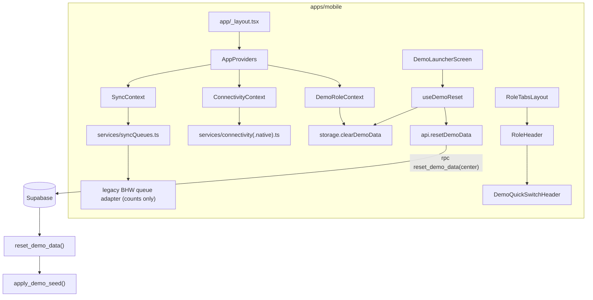

# Design: 01-shared-foundation

## Overview

This design implements `requirements.md` (R1–R23) on top of the existing project described in `docs/audit.md`. It adds:
- one schema migration,
- a seed function in `seed.sql`,
- a generated `apply_foundation.sql`,
- tokens, a status dictionary, components, three contexts and a launcher update in `apps/mobile`.

**Decisions confirmed at requirements review:**
- Install `@react-native-community/netinfo` with `npx expo install`. It is used on native only.
- Icons are Unicode glyphs. No icon dependency is added.
- BHW queue chips keep the label "Synced". Only the Sync Now success message becomes "Sent to demo server".



---

## 1. Files

### New

| Path | Purpose | Req |
|---|---|---|
| `supabase/migrations/20240101000200_shared_foundation.sql` | Columns, tables, constraints, guard and assign triggers, `reset_demo_data()` | R1–R4 |
| `supabase/apply_foundation.sql` | **Generated**: Spec 1+ migrations + seed | R6 |
| `apps/mobile/app/dev/components.tsx` | Route shell for the gallery | R16 |
| `src/shared/status.ts` | Status dictionary + mapping helpers | R12 |
| `src/shared/context/AppProviders.tsx` | Mounts the three providers | R17–R19 |
| `src/shared/context/DemoRoleContext.tsx` | | R17 |
| `src/shared/context/ConnectivityContext.tsx` | | R18 |
| `src/shared/context/SyncContext.tsx` | | R19 |
| `src/shared/services/connectivity.ts` | Web: `navigator.onLine` + events | R18 |
| `src/shared/services/connectivity.native.ts` | Native: NetInfo | R18 |
| `src/shared/services/syncQueues.ts` | Queue registry, single-flight flush, legacy adapter | R19 |
| `src/shared/hooks/useDemoReset.ts` | Reset flow (RPC → clear local → reset contexts) | R10 |
| `src/shared/components/Icon.tsx` | Named Unicode glyphs | R12, R15.9 |
| `src/shared/components/StatusChip.tsx`, `OfflineBanner.tsx`, `LastUpdated.tsx`, `NextStepCard.tsx`, `MeasurementCard.tsx`, `MetricTile.tsx`, `RoleHeader.tsx`, `EmptyState.tsx`, `ConfirmSheet.tsx` | Shared components | R13–R15 |
| `src/shared/screens/DevComponentsScreen.tsx` | Gallery | R16 |

### Modified (smallest change each)

| Path | Change | Req |
|---|---|---|
| `supabase/seed.sql` | Replaced by `apply_demo_seed()` + one call | R7–R9 |
| `supabase/setup.sql` | Regenerated | R5 |
| `scripts/build-setup-sql.mjs` | Also writes `apply_foundation.sql` | R6.5 |
| `apps/mobile/package.json` / lock | `@react-native-community/netinfo` (via `npx expo install`) | R18.3 |
| `apps/mobile/.env.example` | Add `EXPO_PUBLIC_DEMO_MAP_CENTER` | R8.7 |
| `app/_layout.tsx` | Wrap `Stack` in `AppProviders` | R17–R19 |
| `src/shared/theme.ts` | New values, aliases, tints, `type`, `touch` | R11 |
| `src/shared/config/env.ts` | Parse `demoMapCenter` | R8 |
| `src/shared/config/demo.ts` | Add `DEMO_CLINICIAN_ID`, `DEMO_PERSONAS` | R7.10, R20 |
| `src/shared/services/mapbox/config.ts` | `DEMO_MAP_CENTER`; `MOCK_FACILITY` at the centre | R8.6 |
| `MapWeb.tsx`, `MapNative.tsx` | Default `center` = `DEMO_MAP_CENTER` | R8.6 |
| `features/bhw/screens/BHWMapScreen.tsx` | Legend shows the demo centre instead of "Metro Manila …" | R8.6 |
| `src/shared/services/storage.ts` + 3 impls | Add `getItem` / `setItem` / `removeItem` / `clearDemoData` | R10, R17 |
| `src/shared/services/api.ts` | Add `resetDemoData()` | R10 |
| `src/shared/types/db.types.ts` | New optional columns, new row types, `AnyRecordType` | R1–R2 |
| `src/shared/utils/format.ts` | `recordTypeLabel()`, `formatCountOfTotal()`, `formatMeasurement()` | R13–R14 |
| `src/shared/utils/date.ts` | `formatDateDMY()`, `formatDateTimeDMY()` | R22 |
| `src/shared/components/RecordListItem.tsx` | Use `recordTypeLabel()` (new record types) | R1.5 |
| `src/shared/components/DemoQuickSwitchHeader.tsx` | Optional `onSwitch` prop | R15.5 |
| `src/shared/components/RoleTabsLayout.tsx` | Render `RoleHeader` | R15.10 |
| `src/shared/screens/DemoLauncherScreen.tsx` | 4 role cards, personas, label, Reset | R20, R10 |
| `features/bhw/components/SyncStatus.tsx` | `StatusChip` instead of text badges | R12.8 |
| `features/bhw/components/SyncResultNotice.tsx`, `screens/BHWSyncScreen.tsx` | Copy only | R21 |

`sync.ts`, `useOfflineSync.ts`, the two original migrations, and every route path are **not** changed.

---

## 2. Database

### 2.1 Migration `20240101000200_shared_foundation.sql`

Every statement is re-runnable:
- `CREATE TABLE IF NOT EXISTS`
- `ADD COLUMN IF NOT EXISTS`, with **no inline constraints**
- named constraints via `DROP CONSTRAINT IF EXISTS` + `ADD CONSTRAINT`
- `CREATE OR REPLACE FUNCTION`
- `DROP TRIGGER/POLICY IF EXISTS` + `CREATE`
- `CREATE INDEX IF NOT EXISTS`

Inline constraints are avoided because `ADD COLUMN IF NOT EXISTS … REFERENCES/CHECK` behaves differently across Postgres versions when the column exists.

Order inside the file:
1. `clinics`.
2. Columns on existing tables. `patients.clinic_id` needs `clinics`.
3. The new tables.
4. Constraints.
5. Indexes.
6. RLS, policies and grants.
7. Functions and triggers.
8. `NOTIFY pgrst, 'reload schema'`.

**New tables**

| Table | Columns |
|---|---|
| `clinics` | `id uuid pk default gen_random_uuid()`, `name text not null`, `address text`, `contact text`, `services text[] not null default '{}'`, `yakap_accreditation text not null default 'unknown'` CHECK ('listed','unknown'), `source text`, `last_verified_at date`, `created_at timestamptz not null default now()`, `is_seed` |
| `appointments` | `id uuid pk default gen_random_uuid()`, `patient_id uuid not null` → patients CASCADE, `clinic_id uuid` → clinics SET NULL, `purpose text not null`, `scheduled_at timestamptz`, `encounter_status text not null default 'requested'` CHECK (encounter keys), `owner_bhw_id uuid` → bhws SET NULL, `created_at`, `updated_at timestamptz not null default now()`, `is_seed` |
| `care_plans` | `id uuid pk default gen_random_uuid()`, `patient_id` → patients CASCADE, `clinician_admin_id uuid` → admins SET NULL, `summary text not null`, `next_steps text`, `status text not null default 'draft'` CHECK ('draft','released'), `released_at timestamptz`, CHECK `status <> 'released' OR released_at IS NOT NULL`, `created_at`, `updated_at`, `is_seed` |
| `help_requests` | `id uuid PRIMARY KEY` (**no default**), `patient_id uuid not null` → patients CASCADE, `reason text not null` CHECK ('transport','another_date','lab_access','document_help','medicine_access','other'), `message text` CHECK `char_length(message) <= 500`, `created_on_device_at timestamptz not null`, `received_at timestamptz not null default now()`, `assigned_bhw_id uuid` → bhws SET NULL, `coordination_status text not null default 'unassigned'` CHECK (coordination keys), `acknowledged_at timestamptz`, `is_seed` |

**Columns added to existing tables** (C8: existing names are kept; nothing is renamed):

| Table | Column | Type / constraint (named `<table>_<column>_check` / `_fkey`) |
|---|---|---|
| admins | `admin_role` | text not null default 'coordinator', CHECK ('coordinator','clinician') |
| admins | `municipality` | text |
| admins | `is_demo` | boolean not null default false |
| bhws | `last_active_at` | timestamptz |
| patients | `phone` | text |
| patients | `has_smartphone` | boolean (null = unknown) |
| patients | `yakap_stage` | text CHECK ('need_help_getting_started','clinic_selected_pending','first_checkup_planned','checkup_and_assessment','tests_requested','results_review_pending','plan_available','continued_monitoring') |
| patients | `clinic_id` | uuid FK → clinics ON DELETE SET NULL |
| patients | `sharing_consent` | boolean not null default false |
| patients | `created_on_device_at` | timestamptz |
| patients | `updated_at` | timestamptz not null default now() |
| records | `measured_at`, `created_on_device_at` | timestamptz |
| records | `glucose_value` | numeric(6,1) CHECK > 0 |
| records | `glucose_unit` | text CHECK ('mg/dL','mmol/L') |
| records | `glucose_test_type` | text CHECK ('fasting','random','post_meal') |
| records | (glucose consistency) | CHECK: `glucose_value IS NULL OR (glucose_unit IS NOT NULL AND glucose_test_type IS NOT NULL)` |
| records | `height_cm` | numeric(5,1) CHECK 30–250 |
| records | `contact_outcome`, `barrier`, `next_action` | text. Spec 04 owns the vocabulary, so there is no CHECK yet. |
| records | `origin` | text not null default 'field', CHECK ('field','patient','clinic') (C9) |
| records | `transcription_status` | text CHECK ('pending','confirmed'); null = not applicable |
| records | `review_status` | text CHECK ('awaiting_clinical_review','plan_released'); null = not applicable |
| all 9 tables | `is_seed` | boolean not null default false (R4.1, including `connection_test`) |

`records_record_type_check` is dropped and re-added with ('visit','health_update','appointment','vitals','lab_result','note') (C10). Existing BHW sync payloads do not send `origin`, so the default 'field' applies, which is accurate.

After the columns are added, the migration runs `UPDATE connection_test SET is_seed = true WHERE client_type = 'system'`. This keeps the two existing system rows across resets.

**Indexes:** `appointments(patient_id)`, `care_plans(patient_id)`, `help_requests(patient_id)`, `help_requests(assigned_bhw_id)`, `help_requests(coordination_status)`, `patients(clinic_id)`.

**RLS and grants** (C3, R1.9–R1.10):

| Table | Policy "Hackathon demo access" | Grants to anon, authenticated |
|---|---|---|
| clinics | FOR SELECT USING (true) | SELECT |
| appointments, care_plans, help_requests | FOR ALL USING (true) WITH CHECK (true) | SELECT, INSERT, UPDATE |

No DELETE grant is added anywhere.

### 2.2 Triggers

Triggers fire in name order, so the names are prefixed.

**`tg_10_guard_is_seed`** (BEFORE INSERT OR UPDATE, on all 9 tables) runs function `guard_is_seed()`:

```sql
IF current_user IN ('anon', 'authenticated') THEN
  IF TG_OP = 'INSERT' THEN NEW.is_seed := false;
  ELSE NEW.is_seed := OLD.is_seed; END IF;
END IF;
RETURN NEW;
```

Clients therefore cannot create rows that survive a reset, or turn a seed row into a deletable one. The SQL Editor (`postgres`) and the security-definer reset are unaffected.

**`tg_20_help_request_assign`** (BEFORE INSERT on `help_requests`) runs function `help_request_before_insert()`, R3:

```sql
IF NOT NEW.is_seed THEN NEW.received_at := now(); END IF;                  -- R3.4
IF NEW.assigned_bhw_id IS NULL THEN                                        -- R3.3
  SELECT p.bhw_id INTO NEW.assigned_bhw_id FROM public.patients p WHERE p.id = NEW.patient_id;
  IF NEW.assigned_bhw_id IS NOT NULL AND NEW.coordination_status = 'unassigned' THEN
    NEW.coordination_status := 'assigned';                                 -- R3.1
  END IF;
END IF;                                                                    -- else stays 'unassigned' (R3.2)
RETURN NEW;
```

Both functions use `SET search_path = public`. A client retry uses `ON CONFLICT (id) DO NOTHING`. The BEFORE trigger still runs, but the conflicting row is discarded, so exactly one row remains (R3.5).

### 2.3 `reset_demo_data()`

```sql
CREATE OR REPLACE FUNCTION public.reset_demo_data(
  center_lat double precision DEFAULT 14.5995,
  center_lng double precision DEFAULT 120.9842
) RETURNS jsonb
LANGUAGE plpgsql SECURITY DEFINER SET search_path = public AS $$ … $$;
REVOKE ALL ON FUNCTION public.reset_demo_data(double precision, double precision) FROM PUBLIC;
GRANT EXECUTE ON FUNCTION public.reset_demo_data(double precision, double precision) TO anon, authenticated;
```

Steps (one function call = one transaction, so any error rolls back everything, R4.5):
1. Validate the centre. Latitude must be in [-89, 89] and longitude in [-179, 179]. Otherwise `RAISE EXCEPTION 'Invalid demo map centre'`.
2. If `to_regprocedure('public.apply_demo_seed(double precision,double precision)')` is null, raise "Seed not loaded. Run supabase/seed.sql."
3. Delete `is_seed = false` rows, children first: `help_requests`, `care_plans`, `appointments`, `records`, `connection_test`, `patients`, `bhws`. Deleting a non-seed BHW nulls `bhw_id` on any reassigned seed patient. The seed restores it.
4. `PERFORM apply_demo_seed(center_lat, center_lng)`. This restores all seed rows (R4.4).
5. Delete non-seed `admins` and `clinics`. They are deleted last, because seed rows no longer reference them after step 4.
6. Return `{"deleted": {<table>: n, …}, "reset_at": now()}`.

**Security note (R23.6):** anyone holding the anon key can call this function and wipe non-seed data. This is acceptable only for the hackathon demo database. Production must remove the grant or gate it on an authenticated admin.

### 2.4 Seed: `apply_demo_seed(center_lat, center_lng)` in `seed.sql`

`seed.sql` defines the function and then runs `SELECT public.apply_demo_seed();` followed by `NOTIFY pgrst, 'reload schema';`. The seed data stays in `seed.sql`, as R7 requires.

The function:
- is SECURITY INVOKER,
- runs `REVOKE ALL … FROM PUBLIC, anon, authenticated`, because Supabase grants EXECUTE on new public functions by default,
- has an `IF EXISTS (SELECT 1 FROM pg_roles WHERE rolname = 'anon')` guard, so it also runs on plain Postgres.

Every insert is `ON CONFLICT (id) DO UPDATE SET <every column> = EXCLUDED.<column>, is_seed = true`, in parent → child order. Old seed rows (same IDs) are therefore renamed and normalised (R6.2).

**Anchors:**
- `t0 := date_trunc('minute', now())`
- `d0 := current_date`

All times are `t0 ± interval`, which gives the same relative timeline on every run (R4.6). The one exception is the "old" clinic verification date, fixed at `2024-03-01` (R7.7).

**Coordinates:** `latitude = center_lat + dlat` and `longitude = center_lng + dlng`. Each fixed offset satisfies |d| ≤ 0.01 (R8.3). `address` = `'Purok N (DEMO) · approximate DEMO location'` (R8.5). This value is already what the BHW map shows as the marker subtitle.

**IDs:** the existing prefixes are kept (`a`, `b`, `c`, `d`). New prefixes are `e` clinics, `f` appointments, `90` care plans and `80` help requests, all with the form `X0000000-0000-4000-8000-0000000000NN`.

| ID | Row |
|---|---|
| a…01 | Carmen Reyes (DEMO): coordinator, `demo.admin@tuloy.test`, office "Demo Rural Health Unit (DEMO)", municipality "Demo Municipality (DEMO)", `is_demo` |
| a…02 | Dr. Ramon Santos (DEMO): clinician, `demo.clinician@tuloy.test` |
| b…01 | Liza Mendoza (DEMO): Brgy. Demo San Isidro, active, last active t0 − 2 h |
| b…02 | Joel Bautista (DEMO): Brgy. Demo Malinis, active, t0 − 1 day |
| b…03 | Ana Villanueva (DEMO): Brgy. Demo Bagong Pag-asa, **inactive**, t0 − 5 days |
| e…01 | Demo Rural Health Unit Clinic (DEMO): listed, verified d0 − 20 |
| e…02 | Demo Barangay Health Station (DEMO): listed, verified d0 − 45 |
| e…03 | Demo Family Clinic (DEMO): **unknown**, verified 2024-03-01 |

Patients (all `sex`/`birth_date` synthetic, phones `0900-000-1NNN`):

| ID | Name | BHW | Case | Key data |
|---|---|---|---|---|
| c…01 | Juana Dela Cruz (DEMO) | Liza | primary | clinic e…01, stage `plan_available`, smartphone, consent |
| c…02 | Pedro Garcia (DEMO) | Liza | unknown attendance | appointment f…02, t0 − 3 d, `confirmed` (past, no attendance) |
| c…03 | Rosa Aquino (DEMO) | Liza | confirmed missed follow-up | appointment f…03, t0 − 10 d, `missed` |
| c…04 | Lito Ramos (DEMO) | Joel | result awaiting review | record d…010: glucose 126 mg/dL fasting, `awaiting_clinical_review` |
| c…05 | Marites Flores (DEMO) | Joel | unresolved transport barrier | record d…011 barrier `transport`; help request 80…01 `blocked` |
| c…06 | Ernesto Villar (DEMO) | **none** | unassigned | help request 80…02 `document_help`, `unassigned` |
| c…07 | Lorna Pascual (DEMO) | Liza | no smartphone | `has_smartphone = false`; visit d…012 |
| c…08 | Nestor Manalo (DEMO) | Joel | new, no measurements | **no records** (R9.3) |

Records (`origin = 'field'`, `source = 'online'`; every unmeasured field null, R9.4):

| ID | Patient | Type | Data |
|---|---|---|---|
| d…001 | Juana | visit | BP 148/94, measured t0 − 84 d |
| d…008 | Juana | vitals | BP 138/88, t0 − 52 d |
| d…009 | Juana | vitals | BP 132/84, weight 61.0, height 152.0, t0 − 12 d |
| d…002 | Juana | health_update | meds refilled, t0 − 12 d |
| d…003 | Juana | appointment (legacy) | follow-up t0 + 4 d, `scheduled`, kept so existing Patient screens still show it |
| d…004 | Pedro | visit | BP 128/82, t0 − 20 d |
| d…005 | Rosa | visit | BP 120/78, t0 − 40 d (was a legacy appointment; now the appointment lives in f…03) |
| d…006 | Lito | visit | BP 118/76, t0 − 14 d |
| d…007 | Marites | health_update | t0 − 5 d |
| d…010 | Lito | lab_result | glucose 126.0 mg/dL fasting, `transcription_status 'confirmed'`, `review_status 'awaiting_clinical_review'`, t0 − 7 d |
| d…011 | Marites | visit | `contact_outcome 'reached'`, `barrier 'transport'`, `next_action 'Arrange transport to RHU'`, no measurements |
| d…012 | Lorna | visit | BP 124/80, notes "Assisted visit (no smartphone)", t0 − 9 d |

Offsets −84 / −52 / −12 days are at least 32 days apart pairwise, so the three Juana readings always fall in three different calendar months (R9.1).

Appointments, care plans and help requests:

| ID | Row |
|---|---|
| f…01 | Juana, e…01, "Follow-up BP check (DEMO)", t0 + 4 d, `confirmed`, owner Liza |
| f…02 | Pedro, e…02, "Preventive checkup (DEMO)", t0 − 3 d, `confirmed` |
| f…03 | Rosa, e…01, "Follow-up consultation (DEMO)", t0 − 10 d, `missed`, owner Liza |
| f…04 | Lito, e…01, "Fasting blood sugar test (DEMO)", t0 − 7 d, `clinic_confirmed_attended` |
| f…05 | Marites, e…01, "First YAKAP checkup (DEMO)", t0 + 6 d, `requested`, owner Joel |
| 90…01 | Juana, clinician a…02, `released`, released t0 − 10 d, synthetic summary + next steps (no diagnosis wording) |
| 80…01 | Marites, `transport`, created/received t0 − 2 d, assigned Joel, `blocked` |
| 80…02 | Ernesto, `document_help`, t0 − 1 d, `unassigned` |

Juana has no help request, so her live demo request is the only new BHW item (R7.8). `connection_test` system rows are left to the original migration.

### 2.5 Generated SQL files

`build-setup-sql.mjs` writes two files:
- `setup.sql`: all migrations + seed, unchanged behavior.
- `apply_foundation.sql`: migrations whose filename is `>= '20240101000200'`, plus seed. Its header says that it is generated and assumes the two original migrations are already applied.

The two files share one `parts` builder. Line endings are normalised to LF.

Running either file twice is safe because:
- every DDL statement is re-runnable,
- the seed only upserts,
- neither file deletes rows (R6.4).

---

## 3. Client

### 3.1 Env and map centre (R8)

`env.ts` adds:

```ts
const demoMapCenterRaw = (process.env.EXPO_PUBLIC_DEMO_MAP_CENTER ?? '').trim();
// "lat,lng" → { latitude, longitude }; invalid or out of range → DEFAULT_DEMO_CENTER + demoMapCenterWarning
export const DEFAULT_DEMO_CENTER = { latitude: 14.5995, longitude: 120.9842 }; // "Brgy. Demo San Isidro" centre (fictional label)
env.demoMapCenter; env.demoMapCenterWarning: string | null;
```

**Validation:** two finite numbers, latitude in [-89, 89] and longitude in [-179, 179]. These match the SQL check. If the value is invalid, the launcher shows an info `Notice`.

`mapbox/config.ts`:
- adds `DEMO_MAP_CENTER = env.demoMapCenter`,
- puts `MOCK_FACILITY` at that centre,
- keeps `METRO_MANILA_CENTER` exported.

`MapWeb` and `MapNative` default `center` to `DEMO_MAP_CENTER`. Offline-registered patients already use `MOCK_FACILITY`, so they follow the new centre.

### 3.2 Storage additions (R10, R17)

These are additive methods on `LocalStorage`, implemented in `StorageWeb`, `StorageNative.native` and the stub:

```ts
export const LOCAL_V1_PREFIX = 'tuloy:v1:';
getItem<T>(key: `tuloy:v1:${string}`): Promise<T | null>;
setItem<T>(key: `tuloy:v1:${string}`, value: T): Promise<void>;   // throws on failure — no silent fallback
removeItem(key: `tuloy:v1:${string}`): Promise<void>;
clearDemoData(): Promise<{ cleared: number }>;                    // throws with what failed
```

| | Web | Native (`tuloy_offline.db`) |
|---|---|---|
| `get/set/removeItem` | raw `localStorage` key. If `window.localStorage` is unavailable, `setItem` throws `LocalStorageUnavailableError`; it does not use `memoryStore` | new table `kv_v1(key TEXT PK, value TEXT)`, created in `initDB` with `IF NOT EXISTS` |
| `clearDemoData` | collect keys first (`localStorage.key(i)`), then remove those that start with `tuloy:v1:` or `tuloy_cache:`, or equal `tuloy_offline_records`. Matching `memoryStore` entries are also removed. **Other keys are kept** (R10.11). | one `withTransactionAsync`: `DELETE FROM local_sync_queue; DELETE FROM kv_cache; DELETE FROM kv_v1;` |

Native `kv_cache` keys have no prefix (for example `bhw:<id>`), so the whole table is legacy cache. Spec 02 must extend `clearDemoData` for any new outbox table.

`getItem` treats unparsable JSON as `null`. Callers validate the shape.

### 3.3 Contexts (R17–R19)

`AppProviders` = `ConnectivityProvider` › `DemoRoleProvider` › `SyncProvider`. It is mounted in `app/_layout.tsx` around the `Stack`.

**DemoRoleContext**

```ts
interface DemoRoleState { ready: boolean; role: DemoRole | null; personaId: string | null; clinicianMode: boolean }
interface DemoRoleValue extends DemoRoleState {
  selectRole(role: DemoRole, opts?: { personaId?: string; clinicianMode?: boolean }): void;
  setClinicianMode(on: boolean): void;   // no-op unless role === 'admin' (R17.6)
  resetRole(): void;                      // back to initial state, used by reset
}
```

- **Persisted under** `tuloy:v1:demo_role` as `{ v: 1, role, personaId, clinicianMode }`.
- **On start:** restored with a type guard. If the value is invalid, the state stays initial (R17.4).
- **Write failures** are logged and kept in memory; the role switch is never blocked.
- **Default personas** (from `DEMO_PERSONAS` in `demo.ts`): admin → a…01, admin + clinician → a…02, bhw → b…01, patient → c…01.
- **Route wins (R17.5):** `RoleHeader` derives the role from `usePathname()`. If it differs from `role`, it calls `selectRole(pathRole)`.

**ConnectivityContext**

```ts
interface ConnectivityValue {
  isOnline: boolean | null;
  lastOnlineAt: string | null;
  onReconnect(cb: () => void): () => void;
  resetHistory(): void;
}
```

- `services/connectivity.ts` (web) and `connectivity.native.ts` both export `subscribeConnectivity(cb: (online: boolean | null) => void): () => void`.
- Web uses `navigator.onLine` and `online`/`offline` events.
- Native uses `NetInfo.addEventListener`, with `online = isConnected === null ? null : isConnected && isInternetReachable !== false`. Only `.native.ts` imports NetInfo, so the web bundle never contains it.
- `lastOnlineAt` is set to now on every observation of `true` and at the moment the state goes offline. It is persisted to `tuloy:v1:last_online_at`.
- On a `false → true` transition, the `onReconnect` subscribers are called (R18.4). Spec 02 uses this.
- `useOnlineStatus` is untouched.

**SyncContext and `services/syncQueues.ts`**

```ts
export type QueueStatus = 'pending' | 'sending' | 'synced' | 'failed' | 'conflict';
export type QueueCounts = Record<QueueStatus, number>;
export interface SyncQueueAdapter { id: string; getCounts(): Promise<QueueCounts>; flush?(): Promise<void> }
export function registerQueue(a: SyncQueueAdapter): () => void;
export function flushAll(): Promise<void>;          // module-level `let inFlight: Promise<void> | null` (R19.3)
export function getTotalCounts(): Promise<QueueCounts>;
```

- The `legacyBhwQueue` adapter is registered at module load. Its `getCounts` maps `getAllRecords()` statuses 1:1. It has **no `flush`** (R19.4, C1).
- The context exposes `{ counts, isFlushing, flush, refreshCounts }`.
- `refreshCounts` runs on mount, after `flush`, and on demand. No automatic triggers are added (R19.5).
- An adapter that throws is counted as 0, the error is logged, and the other adapters still run.

### 3.4 Reset flow (R10)

```mermaid
sequenceDiagram
  actor P as Presenter
  participant L as Launcher
  participant CS as ConfirmSheet
  participant H as useDemoReset
  participant API as api.resetDemoData
  participant DB as reset_demo_data()
  participant S as storage.clearDemoData
  P->>L: Tap "Reset demo data"
  L->>CS: open (explains what is deleted)
  alt Cancel / Esc / back
    CS-->>L: close, nothing changed (R10.4)
  else Confirm
    CS->>H: run()
    H->>H: status = running (button disabled, spinner) (R10.9)
    H->>API: rpc('reset_demo_data', {center_lat, center_lng})
    API->>DB: one transaction
    alt RPC error / not configured / offline
      DB-->>H: error
      H-->>L: error Notice; local data untouched (R10.6, R10.7)
    else ok
      DB-->>H: {deleted, reset_at}
      H->>S: clear tuloy:v1:*, tuloy_cache:*, tuloy_offline_records / SQLite rows (R10.1, R10.5)
      alt clear fails
        S-->>H: error
        H-->>L: error "Server reset done, but local data on this device was not cleared: …" (R10.8)
      else ok
        H->>H: resetRole(), resetHistory(), refreshCounts() (R10.10)
        H-->>L: router.replace('/'), success Notice "Demo data reset" (R10.2)
      end
    end
  end
```

`useDemoReset()` returns `{ status: 'idle' | 'running' | 'done' | 'error', error: string | null, run() }`. Errors go through `toUserMessage`. The success notice stays on the launcher until the next action.

### 3.5 Status dictionary `src/shared/status.ts` (R12)

```ts
export type StatusTone = 'muted' | 'pending' | 'primary' | 'success' | 'error';
interface StatusEntry { en: string; fil: string; icon: IconName; tone: StatusTone }
// FIL labels: needs native-speaker review
export const STATUS = { transport: {…}, encounter: {…}, clinical: {…}, coordination: {…} } as const satisfies Record<StatusGroup, Record<string, StatusEntry>>;
export type StatusKey = { [G in keyof typeof STATUS]: `${G}.${keyof (typeof STATUS)[G] & string}` }[keyof typeof STATUS];
export function getStatus(key: StatusKey): StatusEntry;
export function legacyQueueStatusKeys(s: SyncStatus): StatusKey[];   // pending → [saved_on_device, waiting_to_send]; failed → [send_failed]; synced → [synced]
export function outboxStatusKeys(s: QueueStatus, kind: 'help_request' | 'bhw_record'): StatusKey[];  // for Spec 02
export function queueStatusText(keys: StatusKey[], lang?: 'en' | 'fil'): string; // joins with " · "
```

Every FIL label has the comment `// needs native-speaker review` (R12.4).

| Key | EN | FIL (needs review) | Icon | Tone |
|---|---|---|---|---|
| transport.saved_on_device | Saved on this device | Naka-save sa device na ito | device | muted |
| transport.waiting_to_send | Waiting to send | Naghihintay maipadala | clock | pending |
| transport.sending | Sending… | Ipinapadala… | arrow-up | primary |
| transport.received_in_inbox | Received in demo clinic inbox | Natanggap sa demo clinic inbox | check | success |
| transport.synced | Synced | Na-sync | check | success |
| transport.send_failed | Not sent yet. Try again. | Hindi pa naipadala. Subukang muli. | alert | error |
| transport.needs_review | Needs review | Kailangang suriin | flag | pending |
| encounter.requested | Requested | Hiniling | calendar | muted |
| encounter.confirmed | Confirmed | Kumpirmado | calendar | primary |
| encounter.patient_reported_attended | Attended (patient-reported) | Dumalo (ayon sa pasyente) | person | primary |
| encounter.clinic_confirmed_attended | Attended (clinic-confirmed) | Dumalo (kumpirmado ng klinika) | check | success |
| encounter.missed | Missed | Hindi nakadalo | alert | pending |
| encounter.rescheduled | Rescheduled | Inilipat ang petsa | repeat | muted |
| clinical.transcription_pending | Transcription pending | Hinihintay ang pag-encode | clock | pending |
| clinical.awaiting_clinical_review | Awaiting clinical review | Hinihintay ang pagsusuri ng doktor | hourglass | pending |
| clinical.plan_released | Plan released | Nailabas na ang plano | document | success |
| coordination.unassigned | Unassigned | Wala pang nakatalaga | circle | pending |
| coordination.assigned | Assigned | Nakatalaga | person | primary |
| coordination.acknowledged | Acknowledged | Natanggap na | check | primary |
| coordination.blocked | Blocked | May hadlang | blocked | error |
| coordination.completed | Completed | Tapos na | check | success |

The keys after the dot equal the DB values for `encounter_status` and `coordination_status`. A clinical key is derived as follows: `transcription_status = 'pending'` → `transcription_pending`, otherwise `review_status`. "Missed" uses pending (amber), not red, to avoid guilt-inducing emphasis (brief §8).

### 3.6 Theme (R11)

Existing colour names are kept. `warning` = `pending` and `danger` = `error` (C13).

| Token | Value | Notes |
|---|---|---|
| primary / primaryBg | #0F766E / #F0FDFA | 5.25:1 |
| text | #16324F | 12+:1 on bg |
| bg, surface | #F8FAFC, #FFFFFF | |
| muted / mutedBg | #475569 / #F1F5F9 | 6.9:1 |
| pending (= warning) / pendingBg (= warningBg) | #B45309 / #FFF7ED | 4.7:1 |
| error (= danger) / errorBg (= dangerBg) | #B91C1C / #FEF2F2 | 5.9:1 |
| success / successBg | #166534 / #F0FDF4 | 6.8:1 |
| offlineBg / offlineText | #16324F / #FFFFFF | 13:1 (navy, never red) |
| border, info, infoBg, primaryText | unchanged | |

Ratios are the WCAG relative-luminance formula for chip text on its tint. The task re-computes them with a script. This is not a full accessibility validation.

The theme also adds:
- `type = { body: 16, small: 14, caption: 13, title: 20, heading: 24, lineHeight: 22 }`
- `touch = { min: 44 }`

### 3.7 Components (R13–R15)

All components use theme tokens, have `accessibilityRole`/`accessibilityLabel`, and have touch targets of at least `touch.min`. Body text is 16px. `Icon` renders `<Text>` with `accessibilityElementsHidden` / `importantForAccessibility="no"`, because the adjacent text carries the meaning.

| Component | Props | Behavior |
|---|---|---|
| `Icon` | `name: IconName`, `size?`, `color?` | Glyph map: device ▯, clock ◷, arrow-up ↑, check ✓, alert ⚠︎, flag ⚑, calendar ▦, person ◉, repeat ↻, hourglass ⧗, document ▤, circle ○, blocked ⊘, offline ⌀, info ⓘ, help ?. Text-presentation glyphs (with U+FE0E where needed), so colour applies. |
| `StatusChip` | `status: StatusKey`, `lang?: 'en'\|'fil'\|'both'` (default `'en'`), `size?: 'sm'\|'md'` | Icon + label on the tone tint; `accessibilityLabel` = label. `'both'` renders "EN · FIL". |
| `StatusChipRow` (exported from StatusChip) | `statuses: StatusKey[]` | Renders "Saved on this device → Waiting to send" as chips with an arrow |
| `OfflineBanner` | `showTagline?` | Renders only when `isOnline === false` (R18.5). Navy bar, `offline` icon, exact copy; optional "Tuloy ang alaga, kahit offline". `accessibilityRole="alert"`; non-blocking. |
| `LastUpdated` | `at: string \| null` | "Last updated 04 Oct 2026, 9:15 AM"; null → "Not updated yet" |
| `NextStepCard` | `action`, `responsible?`, `date?: string \| null`, `dateKind?: 'appointment'\|'due'`, `status: StatusKey`, `onHelp`, `helpLabel?` = "I need help", `children?` | Action first, then responsible, then date ("Appointment 08 Oct 2026, 9:00 AM", or "Date not set yet"), chip, help button |
| `MeasurementCard` | `label`, `value: number \| string \| null \| undefined`, `unit?`, `measuredAt: string \| null`, `context?` (e.g. "Fasting") | Value via `formatMeasurement()`. null/undefined/NaN/'' → "No reading" (R13.1). Date "Measured 04 Oct 2026", or "Date not recorded" (R13.3). |
| `MetricTile` | `label`, `numerator`, `denominator`, `hint?` | Text from `formatCountOfTotal()` |
| `EmptyState` | `title`, `message?`, `icon?`, `action?: { label; onPress }` | Centred, used for "No readings yet" (R13.5) |
| `ConfirmSheet` | `visible`, `title`, `message`, `confirmLabel`, `cancelLabel?` = "Cancel", `destructive?`, `busy?`, `onConfirm`, `onCancel` | RN `Modal` (`transparent`, `animationType="slide"`), bottom-aligned, backdrop press = cancel, `onRequestClose` = cancel (Android back). On web, a `keydown` listener sends Escape to cancel, and focus moves to the sheet title (`ref.focus()`) on open (R15.7). Confirm uses `Button variant="danger"` when `destructive`. |
| `RoleHeader` | — | `DemoQuickSwitchHeader` with `onSwitch={selectRole}` (persistence), plus an admin-only row: a "Clinician mode" switch (`accessibilityRole="switch"`) and, when on, "Simulated role — no real authentication" and the persona name |

`DemoQuickSwitchHeader` gains an optional `onSwitch?: (role: DemoRole) => void` prop. It is called before `router.navigate`; everything else is unchanged. `RoleTabsLayout` swaps `<DemoQuickSwitchHeader />` for `<RoleHeader />`.

**Pure helpers:**

```ts
// format.ts
formatCountOfTotal(n: number, d: number): string
//   invalid (non-integer, negative, n > d) → "Not available"; d === 0 → "No cases"; else `${n} of ${d} (${Math.round(100*n/d)}%)`
formatMeasurement(value: number | string | null | undefined, unit?: string): string
//   missing → "No reading"; else `${value}${unit ? ' ' + unit : ''}`
formatBPValue(sys: number | null | undefined, dia: number | null | undefined): string | null
//   null if either is missing (R13.4)
recordTypeLabel(t: AnyRecordType): string
//   covers the 3 existing + vitals / lab_result / note

// date.ts — manual month table, no locale (R22.1)
formatDateDMY(iso): string        // "04 Oct 2026"; date-only strings via parseYMD; invalid → "—"
formatDateTimeDMY(iso): string    // "04 Oct 2026, 9:15 AM" (local time, 12 h)
```

**Types:**
- `RecordType` stays the 3-value union, so the BHW `RecordForm` chips and `DEFAULT_TITLE` are unchanged.
- The new `AnyRecordType = RecordType | 'vitals' | 'lab_result' | 'note'` is used for `HealthRecord.record_type`. The compiler then flags every `RECORD_TYPE_LABEL[record.record_type]` lookup; today the only one is `RecordListItem`, which switches to `recordTypeLabel()`.
- New columns are added as **optional** fields on the existing interfaces.
- New interfaces `Clinic`, `Appointment`, `CarePlan` and `HelpRequest` are added.

### 3.8 Gallery `/dev/components` (R16)

- `app/dev/components.tsx` is only `export { default } from '../../src/shared/screens/DevComponentsScreen'`.
- On native the screen renders "The component gallery is available on web only".
- On web it renders:
  - one section per component,
  - every `StatusKey` in EN and FIL (the "FIL: needs native-speaker review" note is shown),
  - `MeasurementCard` with a value, with null and with no date,
  - BP with a missing diastolic value,
  - `MetricTile` with 18/30, 0/0 and an invalid input,
  - `OfflineBanner` forced visible through an internal preview prop,
  - an interactive `ConfirmSheet`.
- Nothing links to the route (R16.4). The static export still emits `dev/components.html`, which is acceptable.

### 3.9 Launcher (R20) and Sync copy (R21)

`DemoLauncherScreen` keeps its layout and notices, and gets these changes:
- **Role cards** come from a 4-item array: Admin (Carmen Reyes (DEMO)), Clinician (Dr. Ramon Santos (DEMO), admin colour, "restricted clinical review"), BHW (Liza Mendoza (DEMO) · Brgy. Demo San Isidro), Patient (Juana Dela Cruz (DEMO)).
- **On press,** a card calls `selectRole(...)` and then navigates to `/admin`, `/admin`, `/bhw` or `/patient`.
- **The subtitle line** reads "Simulated role — no real authentication".
- **The chain pill** for the admin role keeps its label.
- **Reset:** a `Button variant="danger"` "Reset demo data" sits below the cards. It opens `ConfirmSheet` with the text: "This deletes everything created during demos on the server, restores the original DEMO DATA, and clears saved data on this device. Continue?"
- **Notices:** the reset result `Notice` appears directly under the button, and a `demoMapCenterWarning` notice is added.

Sync copy changes (no logic change):
- `SyncResultNotice`:
  - success → "Sent to demo server · N record(s)."
  - nothing to send → "Nothing to send. Every record has already been sent to the demo server."
  - partial → "Sent N of M to the demo server. …"
  - rejected → "Sent N, M rejected by the server (see queue). They will retry next time."
- `BHWSyncScreen` subtitle → "Send field records to the demo server". The footnote adds "Full cloud sync is deferred."
- `SyncStatus` replaces the badge with `<StatusChipRow statuses={legacyQueueStatusKeys(item.sync_status)} />`.

---

## 4. Error handling

| Situation | Behavior |
|---|---|
| Supabase not configured / offline during reset | `toUserMessage` error Notice; local data untouched |
| `apply_demo_seed` missing | RPC raises "Seed not loaded. Run supabase/seed.sql."; shown as is |
| Invalid demo centre | Client falls back to the default and shows a warning; SQL raises if called directly with bad values |
| localStorage unavailable or quota on `setItem` | Throws; `DemoRoleContext` keeps state in memory and logs; reset reports the failure |
| Corrupt persisted role | Ignored → initial state |
| NetInfo reports null | `isOnline = null`, no banner |
| A queue adapter throws | Counted as 0, logged, other adapters continue |

## 5. Verification strategy

- **Typecheck:** `npm run typecheck` after every task (C17: no lint).
- **SQL:** in a temp folder outside the repo, use `npx @electric-sql/pglite` from a small Node script. It creates the roles `anon`/`authenticated`, then:
  1. Runs `setup.sql` twice on an empty DB.
  2. Builds a DB from `git show HEAD:` versions of the two original migrations + old seed, then runs `apply_foundation.sql` twice.
  3. Asserts: row counts unchanged on the 2nd run; personas renamed; 8 patients; Juana has 3 BP readings in 3 distinct months; Nestor has 0 records; all names end in "(DEMO)"; all patient offsets ≤ 0.01.
  4. As `anon`: inserts a help request for Juana (→ assigned to Liza, `received_at` = now) and for Ernesto (→ unassigned); re-inserts the same id with `ON CONFLICT DO NOTHING` (1 row); tries to insert `is_seed = true` (stored false).
  5. Edits a seed row, adds non-seed rows, calls `reset_demo_data(10.0, 123.0)`, and asserts non-seed rows are gone, seed rows are restored, and patients lie within 0.01° of (10, 123).

  The temp folder is deleted afterwards. If PGlite cannot run, the task says so; the fallback is a manual run in the Supabase SQL Editor.
- **Pure helpers:** a temporary `tsx` script asserts `formatCountOfTotal`, `formatMeasurement`, `formatBPValue`, `formatDateDMY` and the contrast ratios. It is deleted afterwards; no test framework is added.
- **Web bundle:** `npx expo export --platform web --output-dir <temp>`, then grep for `expo-sqlite`, `@rnmapbox` and `RNCNetInfo` (expect none), then delete the folder.
- **Manual (browser):** check the launcher's 4 cards, clinician mode label, Reset confirm/cancel/success/error, `/dev/components`, the offline banner with DevTools Offline, and the BHW Sync copy and chips.
- **Not verifiable here:** native NetInfo and SQLite behavior on a device; screen-reader behavior.

## 6. Risks

- **Reset is callable by anyone with the anon key.** Accepted for the hackathon only (§2.3).
- **Theme value change shifts colours app-wide.** This is intended (brief wins). It is spot-checked in the browser.
- **Juana's legacy appointment record (d…003) and appointment f…01 describe the same follow-up.** Spec 03 should read `appointments` and ignore legacy appointment records for Juana, or de-duplicate them by date.
- **Unicode glyph rendering varies by font.** The gallery is the check; if a glyph renders badly, swap the character in `Icon` only.
