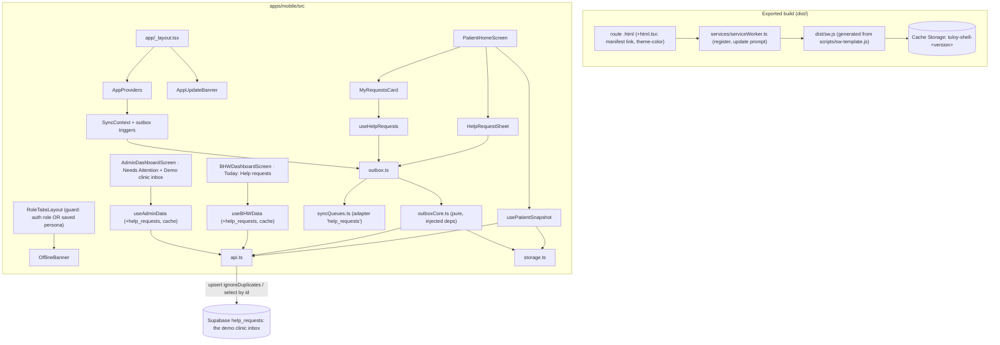
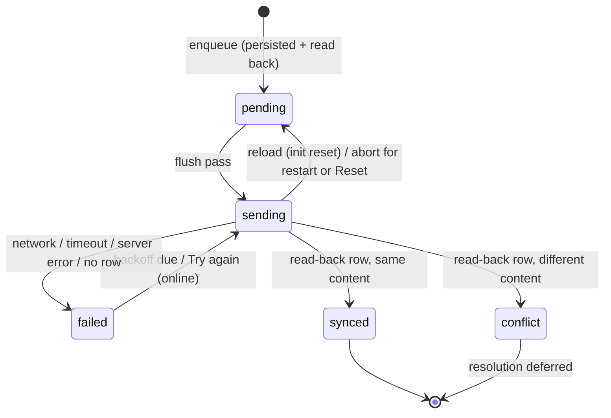

# Design: 02-offline-first-core

## Overview

This design implements `requirements.md` (OC-1 to OC-17). It is additive and builds on the Spec 01 contexts, storage, status dictionary and components.

**Approved decisions:**
- **K1:** the route guard also accepts the saved demo persona, and Logout clears it.
- **K3:** the failure label is "Not sent yet. Try again."
- **K6:** Today and Needs Attention are sections on the existing index screens.
- **K8:** Try again makes no network attempt while offline.
- **K9:** the target is Vercel at the root path. The GitHub Pages deploy does not need to work offline.

**SQL: none.** No migration and no `supabase/apply_spec2.sql`. The design relies only on the Spec 01 schema. Prerequisite: `supabase/apply_foundation.sql` has been applied.



---

## 1. Files

All paths are under `apps/mobile/` unless stated otherwise.

### New

| Path | Purpose | Req |
|---|---|---|
| `app/+html.tsx` | Root HTML for the static export: the default Expo head plus a manifest link, `theme-color` and `apple-touch-icon` | OC-10.9 |
| `public/manifest.json` | Web manifest | OC-10.9 |
| `public/icons/icon-192.png`, `public/icons/icon-512.png` | Generated once from `assets/icon.png` and committed. `public/assets` is reserved by Metro, so they go in `public/icons`. | OC-10.9 |
| `scripts/sw-template.js` | Hand-written service worker with `__PRECACHE__` and `__VERSION__` placeholders | OC-10 |
| `scripts/build-sw.mjs` | Runs after export: walks `dist/`, builds the manifest and version, writes `dist/sw.js` | OC-10.1 |
| `src/shared/services/serviceWorker.ts` | Web: register the worker, detect updates, apply an update | OC-10.2, 10.6–10.8 |
| `src/shared/services/serviceWorker.native.ts` | No-op | OC-16.3 |
| `src/shared/components/AppUpdateBanner.tsx` | "A new version of Tuloy is available." plus **Reload** | OC-10.6 |
| `src/shared/services/foreground.ts` / `foreground.native.ts` | `subscribeForeground(cb)`: `visibilitychange` on web, `AppState` 'active' on native | OC-4.2, OC-16.2 |
| `src/shared/services/resetEpoch.ts` | `currentEpoch()` and `bumpEpoch()`. Writes from work started before a Reset are discarded. | OC-17 |
| `src/shared/services/outboxCore.ts` | Pure outbox logic, with no React Native imports | OC-5, 6, 11 |
| `src/shared/services/outbox.ts` | Wires the core to `storage`, `api`, `newId` and timers; registers the queue adapter | OC-11.5 |
| `src/shared/helpRequests.ts` | Reason list (EN/FIL), urgent-care and deferred copy (EN/FIL), `helpReasonLabel()` | OC-9, 12, 14 |
| `src/shared/hooks/useEffectiveRole.ts` | `{ loading, role, isDemoPersona }` from Auth and DemoRole | OC-15 |
| `src/shared/components/HelpRequestItem.tsx` | One request row: reason, timestamps, chips. Used by Patient, BHW and Admin. | OC-7, 12.6 |
| `src/features/patient/hooks/usePatientSnapshot.ts` | Snapshot load (cache-then-network) and the current patient id | OC-1, 13 |
| `src/features/patient/hooks/useHelpRequests.ts` | Live outbox list for a patient, plus `retry` / `retryAll` | OC-12.6–12.7 |
| `src/features/patient/components/HelpRequestSheet.tsx` | Reason chips, message, urgent-care text, Submit, saved state | OC-2, 9, 12 |
| `src/features/patient/components/MyRequestsCard.tsx` | "My requests" list with Try again and deferred notes | OC-3, 6, 12, 14 |
| `src/features/patient/components/CarePlanSummaryCard.tsx` | Released plan summary | OC-1.4 |
| `src/features/patient/components/YakapStepLine.tsx` | "My YAKAP Checkup: <stage>" | OC-1.4 |
| `src/features/bhw/components/TodayHelpRequests.tsx` | "Today · Help requests" section | OC-7.1–7.2 |
| `src/features/admin/components/NeedsAttentionHelpRequests.tsx` | Unassigned requests section | OC-7.3 |
| `src/features/admin/components/DemoClinicInbox.tsx` | Read-only latest 20 | OC-7.4 |

### Modified

| Path | Change | Req |
|---|---|---|
| `package.json` | `"export:web": "expo export --platform web && node scripts/build-sw.mjs"` | OC-10.1 |
| `vercel.json` | `"buildCommand": "npm run export:web"` | OC-10.1 |
| `app/_layout.tsx` | Render `<AppUpdateBanner />` inside `AppProviders` | OC-10.6 |
| `app/index.tsx` | Use `useEffectiveRole` | OC-15.2 |
| `src/shared/components/RoleTabsLayout.tsx` | Guard uses `useEffectiveRole`; render `<OfflineBanner />` under `RoleHeader` | OC-15, OC-1.2 |
| `src/shared/components/DemoQuickSwitchHeader.tsx` | Badge and Logout also work for a saved persona; Logout also calls `resetRole()` | OC-15.3 |
| `src/shared/context/AuthContext.tsx` | `getSession()` rejection ends loading | OC-15.4 |
| `src/shared/context/SyncContext.tsx` | Outbox triggers; `isFlushing` and counts follow outbox events | OC-4 |
| `src/shared/hooks/useDemoReset.ts` | After the RPC succeeds: `bumpEpoch()` and `outbox.stopForReset()` before `clearDemoData()`; `outbox.notify()` after | OC-17 |
| `src/shared/services/storage.ts` + `StorageWeb.ts`, `StorageNative.native.ts`, `StorageNative.ts` (stub) | Add `listItems(prefix)`. On web, the legacy `write()` throws when real storage rejects. | OC-8.4, K5 |
| `src/shared/services/api.ts` | Help-request, appointment, care-plan and clinic functions (§5) | OC-5, 7, 13 |
| `src/shared/types/db.types.ts` | `HelpRequestRow`, `HelpRequestWithPatient` | OC-7 |
| `src/features/patient/hooks/usePatientData.ts`, `useHealthRecords.ts` | Derived from `usePatientSnapshot`; the return shapes stay the same | OC-1.4 |
| `src/features/patient/screens/PatientHomeScreen.tsx` | New layout (§7.1) | OC-1, 12 |
| `src/features/patient/screens/PatientProfileScreen.tsx`, `PatientHealthScreen.tsx` | `LastUpdated` + no-snapshot state | OC-1.4 |
| `src/features/bhw/hooks/useBHWData.ts` | Help requests in the fetch and cache; merge synced queue items; cache-write errors are non-fatal | OC-7, 8.3 |
| `src/features/bhw/types/bhw.types.ts` | `BHWData.helpRequests` | OC-7 |
| `src/features/bhw/screens/BHWDashboardScreen.tsx` | Render `TodayHelpRequests` first; use the persona's BHW id | OC-7 |
| `src/features/admin/hooks/useAdminData.ts`, `types/admin.types.ts` | Cache-then-network; help requests | OC-7, 8.2 |
| `src/features/admin/screens/AdminDashboardScreen.tsx` | The two new sections; "Live field records" becomes "Latest field records" | OC-7, 9.4 |

These are **not** changed: `sync.ts`, `useOfflineSync.ts`, `syncQueues.ts` (it already supports registration), the migrations, `seed.sql`, `setup.sql`, the route paths and the tab names.

---

## 2. Offline app shell (web)

### 2.1 Build

`npm run export:web` runs `expo export --platform web` (which copies `public/` into `dist/`), then `node scripts/build-sw.mjs`.

`build-sw.mjs` (plain Node ESM, no dependencies):

1. Fail with a clear message if `dist/index.html` is missing.
2. Walk `dist/` recursively. Use POSIX URLs and skip `sw.js`, `*.map` and dotfiles. Sort the result.
3. Classify each file:
   - `*.html` becomes a **route** `{ url: routeKey(path), file: '/' + path }`, where:
     - `index.html` → `/`
     - `a/index.html` → `/a`
     - `a/b.html` → `/a/b`
     - a `+not-found.html` (or `_sitemap.html`) is kept and also recorded as `notFound` when present.
   - Anything else becomes an **asset** `{ url: '/' + path }`.
4. `version` = the first 12 hex characters of the sha256 over the sorted `path + '\0' + sha256(content)` lines. It changes exactly when any file changes.
5. Read `scripts/sw-template.js` and replace `self.__PRECACHE__` with `JSON.stringify({ version, routes, assets, notFound })`. Write `dist/sw.js` and print `sw.js: <n> routes, <m> assets, version <v>`.
6. Exit non-zero if no route was found.

### 2.2 `sw-template.js`

The template is plain JS with a `/* global self, caches */` header. It is not TypeScript and not bundled.

```js
const MANIFEST = self.__PRECACHE__;           // replaced at build time
const CACHE = `tuloy-shell-${MANIFEST.version}`;
const ROUTES = new Map(MANIFEST.routes.map((r) => [r.url, r.file]));

function routeKey(pathname) {                 // same rule as build-sw.mjs
  let p = decodeURIComponent(pathname).replace(/\.html$/, '').replace(/\/index$/, '');
  if (p.length > 1) p = p.replace(/\/+$/, '');
  return p || '/';
}

install:  event.waitUntil(precache())  // no skipWaiting() here (the update prompt decides)
precache:
  cache = await caches.open(CACHE)
  for each asset: res = await fetch(url, { cache: 'reload' }); if (!res.ok) throw …; await cache.put(url, res)
  for each route: res = await fetch(file, { cache: 'reload', redirect: 'follow' }); if (!res.ok) throw …
                  // serve/Vercel cleanUrls redirect /x.html → /x. A redirected response cannot answer a navigation, so re-wrap it:
                  await cache.put(route.url, new Response(await res.blob(), { status: 200, headers: { 'Content-Type': 'text/html; charset=utf-8' } }))
  // Any throw rejects install → the old worker stays active (OC-10.3)

activate: delete every cache starting with 'tuloy-shell-' except CACHE; then clients.claim()
message:  { type: 'SKIP_WAITING' } → self.skipWaiting()

fetch(event):
  req = event.request
  if req.method !== 'GET' or new URL(req.url).origin !== self.location.origin → return (browser default)   // OC-10.5
  if req.mode === 'navigate':
     key = routeKey(url.pathname)
     respondWith(
       ROUTES.has(key) ? cachedOrNetwork(key)          // cache-first: the shell matches this version's JS
                       : fetch(req).catch(() => cached(MANIFEST.notFound ? routeKey(MANIFEST.notFound) : '/'))
     )
  else if precached(url.pathname):
     respondWith(caches.match(url.pathname, { cacheName: CACHE }).then((r) => r || fetch(req)))
  // anything else: network (browser default)
```

**Why cache-first for route HTML.** The HTML references hashed JS chunks of the same build. Serving the cached HTML keeps the HTML and JS of one version together. New versions arrive through the update prompt (§2.3), not by mixing versions.

`/sw.js` itself is never precached. The browser checks it on `register`, on `update()` and on navigations. Cache headers for it are Spec 06.

### 2.3 Registration and update prompt (`serviceWorker.ts`)

```ts
export interface ShellUpdate { apply(): void }
export function registerServiceWorker(onUpdate: (u: ShellUpdate) => void): () => void;
```

The function returns a no-op unless all of these hold: `process.env.NODE_ENV === 'production'`, `typeof navigator !== 'undefined'`, `'serviceWorker' in navigator` and `window.isSecureContext` (OC-10.2). `localhost` counts as secure. Under `expo start`, NODE_ENV is 'development', so nothing registers.

Steps:
1. Run `navigator.serviceWorker.register('/sw.js', { scope: '/' })` after `load`, or at once if the page has already loaded.
2. Watch for a new version:
   - If `reg.waiting && navigator.serviceWorker.controller`, offer the update.
   - On `updatefound`, watch `installing`. When it reaches `'installed'` and `navigator.serviceWorker.controller` exists, offer the update.

   "Offer the update" means calling `onUpdate({ apply })`. A first install has no controller, so it shows no prompt.
3. `apply()`:
   - set `reloading = false`,
   - add a `controllerchange` listener that reloads once (`if (!reloading) { reloading = true; location.reload(); }`),
   - then send `reg.waiting.postMessage({ type: 'SKIP_WAITING' })` (OC-10.7).
4. On `visibilitychange`, when visible, call `reg.update()` and ignore errors (OC-10.8).
5. Any error is logged with `console.warn` and never thrown into the UI.

`AppUpdateBanner` holds `update: ShellUpdate | null` and registers in a `useEffect`. While an update is waiting, it renders a slim surface banner with an info icon, the text "A new version of Tuloy is available." and a 44 px **Reload** button (`accessibilityLabel="Reload to update Tuloy"`).

### 2.4 `+html.tsx` and manifest

`+html.tsx` reproduces Expo's default root HTML:
- `lang="en"`, `charSet`, `X-UA-Compatible` and the viewport meta,
- `<ScrollViewStyleReset />` from `expo-router/html`,
- the default body background style.

It then adds:

```tsx
<link rel="manifest" href="/manifest.json" />
<meta name="theme-color" content="#0F766E" />
<link rel="apple-touch-icon" href="/icons/icon-192.png" />
```

Task 2 compares the exported `index.html` `<head>` before and after this change. Only these three tags may be new, and nothing else may be missing.

`manifest.json`:

```json
{ "name": "Tuloy", "short_name": "Tuloy", "description": "Alaga, tuloy-tuloy. DEMO DATA only.",
  "start_url": "/", "scope": "/", "display": "standalone",
  "theme_color": "#0F766E", "background_color": "#F8FAFC",
  "icons": [ { "src": "/icons/icon-192.png", "sizes": "192x192", "type": "image/png", "purpose": "any" },
             { "src": "/icons/icon-512.png", "sizes": "512x512", "type": "image/png", "purpose": "any" } ] }
```

The icons are resized from `assets/icon.png` (1024²) with a temporary script and committed. CI does not need an image tool.

---

## 3. Help-request outbox

### 3.1 Item and storage

```ts
// outboxCore.ts
export const HELP_REASONS = ['transport', 'another_date', 'lab_access', 'document_help', 'medicine_access', 'other'] as const; // = db HelpReason
export const OUTBOX_PREFIX = 'tuloy:v1:help_requests:';
export interface HelpRequestDraft { id: string; patient_id: string; reason: HelpReason; message: string | null }
export interface OutboxItem {
  id: string; patient_id: string; reason: HelpReason; message: string | null;
  created_on_device_at: string;          // ISO, set at enqueue
  received_at: string | null;            // server value, set when synced
  _sync_status: QueueStatus;             // 'pending' | 'sending' | 'synced' | 'failed' | 'conflict'
  _attempts: number;
  _last_error: string | null;
  _local_updated_at: string;
  _next_attempt_at: string | null;       // null = no automatic retry scheduled
}
export type ServerRow = Pick<OutboxItem, 'id' | 'patient_id' | 'reason' | 'message' | 'created_on_device_at'>;
```

There is one key per item, `tuloy:v1:help_requests:<id>`. On web that is localStorage. On native it is the SQLite `kv_v1` table. `clearDemoData` already removes both (OC-17).

New storage method (additive, on web, native and the stub):

```ts
listItems<T>(prefix: LocalV1Key): Promise<{ key: LocalV1Key; value: T }[]>;
```

- **Web:** collect `localStorage.key(i)` values that start with the prefix, then `getItem` each one. Unparsable values are skipped and logged.
- **Native:** `SELECT key, value FROM kv_v1 WHERE substr(key, 1, ?) = ?` with `[prefix.length, prefix]`. This is an exact prefix match with no `LIKE` wildcards (OC-16.1).

A stored item is shape-checked by `isOutboxItem()`. Invalid entries are skipped and logged, and they are never deleted silently.

### 3.2 Core API (dependency-injected)

```ts
export interface OutboxDeps {
  store: { list(): Promise<OutboxItem[]>; get(id: string): Promise<OutboxItem | null>; put(item: OutboxItem): Promise<void> };
  remote: {
    insert(row: ServerRow, signal: AbortSignal): Promise<void>;                     // upsert onConflict id, ignoreDuplicates
    readBack(id: string, signal: AbortSignal): Promise<(ServerRow & { received_at: string }) | null>;
  };
  isOnline(): boolean | null;
  classify(error: unknown): 'network' | 'permanent' | 'transient';
  now(): number;
  epoch(): number;                          // resetEpoch.currentEpoch
  setTimer(fn: () => void, ms: number): unknown; clearTimer(handle: unknown): void;
  requestTimeoutMs?: number;                // default 10_000
}
export function createOutbox(deps: OutboxDeps): {
  init(): Promise<void>;                                  // stale 'sending' → 'pending' (idempotent, memoised)
  enqueue(draft: HelpRequestDraft): Promise<OutboxItem>;  // persist + read back; an existing id returns the stored item unchanged
  list(patientId?: string): Promise<OutboxItem[]>;        // newest created first
  counts(): Promise<QueueCounts>;
  flush(opts?: { force?: string[] | 'all'; restart?: boolean }): Promise<FlushResult>;
  stopForReset(): void;                                   // abort, clear timer, drop rerun/force
  subscribe(listener: (e: OutboxEvent) => void): () => void; // 'changed' | 'flush-start' | 'flush-end'
  isFlushing(): boolean;
};
export const BACKOFF_MS = [2_000, 5_000, 15_000, 60_000];
```

`outbox.ts` makes the singleton:
- `store` wraps `getStorage()` plus `listItems(OUTBOX_PREFIX)`,
- `remote` wraps `api.insertHelpRequest` and `api.fetchHelpRequestById`,
- `isOnline` comes from a ref that `SyncProvider` sets with `setOutboxOnlineGetter`,
- `classify` uses `isNetworkError`; an `AbortError` or timeout counts as network, Postgres codes `22*`, `23*` and `42*` count as permanent, and everything else is transient,
- `epoch` comes from `resetEpoch`.

`outbox.ts` also exports `registerQueue({ id: 'help_requests', getCounts: outbox.counts, flush: () => outbox.flush().then(() => undefined) })`, called at module load (OC-11.5).

On web it adds a `storage` event listener for keys with `OUTBOX_PREFIX`, which emits `'changed'`. Other tabs' writes then refresh the list. Only the UI updates; there is no cross-tab flush coordination.

**enqueue** (OC-2):
1. Validate: the reason is in `HELP_REASONS`, `patient_id` is non-empty, and the message is trimmed (empty becomes null, more than 500 characters is rejected).
2. `existing = await store.get(id)`. If found, return it (OC-2.4).
3. Build the item with `pending`, `_attempts: 0`, `created_on_device_at = now`, `_next_attempt_at = null`.
4. `await store.put(item)`, then `await store.get(id)`. If the read-back is missing or has a different id, throw `LocalStorageUnavailableError('Saved data could not be read back')`.
5. Emit `'changed'` and return the item. The caller confirms only after this resolves.
6. `outbox.ts` (not the core) then calls `flush()` without awaiting it if `isOnline() !== false` (K7).

**flush** (single-flight, OC-5.3):

```
if isOnline() === false → return { skipped: 'offline' }          // K8, OC-6.3
merge opts.force into forceIds
if running:
  rerun = true
  if opts.restart: controller.abort()                            // OC-4.1 reconnect
  return running
running = (async () => {
  await init()
  const e = epoch()
  do { rerun = false; await pass(e) } while (rerun && e === epoch() && isOnline() !== false)
  scheduleRetry(e)
})().finally(() => { running = null; emit('flush-end') })
emit('flush-start')
return running
```

**pass(e):**
1. `items = (await list()).filter(eligible)`, sorted by `created_on_device_at` ascending. An item is eligible when it is:
   - `pending`, or
   - `failed` with `_next_attempt_at !== null && _next_attempt_at <= now`, or
   - `failed` and its id is in `forceIds` (or force is `'all'`).

   Then clear `forceIds`.
2. For each item:
   - If `e !== epoch()`, return. This is a Reset guard, and it is checked again before every write (OC-17.1).
   - `put({ ...item, _sync_status: 'sending', _local_updated_at })` and emit `'changed'`.
   - Create `controller = new AbortController()` with a timeout timer of `requestTimeoutMs` that calls `controller.abort('timeout')`.
   - `await remote.insert(row(item), signal)`, then `server = await remote.readBack(item.id, signal)`.
   - **Outcome:**

     | Result | New item state |
     |---|---|
     | `server === null` | `failed`, `_last_error = 'Not confirmed by the demo clinic inbox yet.'`, `_attempts++`, backoff |
     | `sameContent(item, server)` | `synced`, `received_at = server.received_at`, `_last_error = null`, `_next_attempt_at = null` |
     | content differs | `conflict`, `_last_error = 'Different request with this ID in the demo clinic inbox.'`, `_next_attempt_at = null`. Local content is untouched and nothing is sent (OC-6.4). |

   - **On error:**

     | Error | New item state |
     |---|---|
     | Aborted by restart or Reset (not timeout) | `pending`, `_attempts` unchanged, then stop the pass |
     | `classify = 'network'` or timeout | `failed`, `_attempts++`, `_last_error = message`, backoff, then **stop the pass** (OC-11.4) |
     | `'transient'` | `failed`, `_attempts++`, backoff, continue with the next item |
     | `'permanent'` | `failed`, `_attempts++`, `_next_attempt_at = null` (manual Try again only), continue |

   - The backoff is `_next_attempt_at = now + BACKOFF_MS[min(_attempts, 4) - 1]` (OC-6.2).
   - Emit `'changed'` after every write.

**sameContent(local, server):** all four must match:
- `patient_id` is equal,
- `reason` is equal,
- `(message ?? null) === (server.message ?? null)`,
- `Date.parse(local.created_on_device_at) === Date.parse(server.created_on_device_at)`.

Postgres returns `+00:00` with microseconds. The client sends millisecond ISO, so the parsed values are equal.

**scheduleRetry(e):**
1. Clear the old timer.
2. If `e !== epoch()` or `isOnline() === false`, stop.
3. Find the earliest `_next_attempt_at` among failed items. Set a timer for `max(0, t - now)` that calls `flush()`.

The timer lives only while the app is open, so nothing is sent while it is closed (deferred).

**init():** runs once per load. For every item in `sending`, `put` it as `pending` without changing `_attempts` (OC-5.4). It is memoised as a promise, and `flush`, `list` and `counts` await it.

**Why this is exactly once (OC-5):**
- The id is fixed at form open and persisted before any send.
- The server's PK on `id` plus `ON CONFLICT (id) DO NOTHING` makes every repeat insert a no-op. The BEFORE INSERT trigger runs, but its row is discarded.
- The help-request client never UPDATEs `help_requests`.
- A reload mid-send leaves `sending`, which `init()` resets to `pending`. The next insert is a no-op, and the read-back confirms the row.
- Two tabs flushing the same item both get the same single row.
- BHW and Admin lists are server rows keyed by `id`, so one row is one item.

### 3.3 State machine



### 3.4 Sequence: save → pending → sending → read-back → synced, with the failure and conflict branches

```mermaid
sequenceDiagram
  actor P as Patient
  participant UI as HelpRequestSheet / MyRequestsCard
  participant OX as outbox (core)
  participant LS as storage (localStorage / SQLite kv_v1)
  participant SC as SyncProvider triggers
  participant API as api.ts
  participant DB as Supabase help_requests (demo clinic inbox)

  P->>UI: choose reason, optional message, Submit
  UI->>OX: enqueue({id (created at form open), patient_id, reason, message})
  OX->>LS: put tuloy:v1:help_requests:<id> {_sync_status: pending}
  OX->>LS: get <id> (read back)
  alt write or read-back fails
    LS-->>OX: error
    OX-->>UI: throw → "Could not save on this device: …" (form kept, no confirmation)
  else persisted
    OX-->>UI: item
    UI-->>P: "Saved on this device" + chips [Saved on this device] [Waiting to send]
  end

  Note over SC: triggers: app start (online) · offline→online (restart) · foreground · submit while online · Try again
  SC->>OX: flush()
  alt isOnline() === false
    OX-->>SC: skipped (item stays pending; Try again shows "You're offline…")
  else online (single-flight: concurrent calls join, set rerun)
    OX->>LS: put {_sync_status: sending}
    UI-->>P: chip [Sending…]
    OX->>API: insertHelpRequest(row) — upsert onConflict id, ignoreDuplicates (10 s timeout)
    API->>DB: INSERT … ON CONFLICT (id) DO NOTHING
    alt network error / timeout / server error
      DB--xAPI: error
      API-->>OX: throw
      OX->>LS: put {failed, _attempts+1, _last_error, _next_attempt_at = now + 2s/5s/15s/60s}
      UI-->>P: chip [Not sent yet. Try again.] + Try again
      Note over OX: network error ends the pass; retry timer runs only while the app is open
    else insert accepted (new row, or duplicate ignored)
      DB-->>API: 201 (trigger set received_at, assigned_bhw_id)
      OX->>API: fetchHelpRequestById(id)
      API->>DB: SELECT … WHERE id = :id
      alt no row returned
        OX->>LS: put {failed, _last_error: "Not confirmed by the demo clinic inbox yet."}
        UI-->>P: [Not sent yet. Try again.]
      else row with same patient, reason, message, created_on_device_at
        OX->>LS: put {synced, received_at: server.received_at}
        UI-->>P: chip [Received in demo clinic inbox] + "Received <date, time>"
      else row with different content (conflict)
        OX->>LS: put {conflict, _last_error} — local content unchanged, no server write
        UI-->>P: chip [Needs review] + "Nothing was overwritten. Resolving this in the app isn't available yet."
      end
    end
  end
  opt reload mid-send
    P->>UI: reload
    OX->>LS: init(): sending → pending (before the first flush)
    Note over OX,DB: the next insert is a no-op if the row exists; the read-back then confirms → synced
  end
```

### 3.5 Triggers (`SyncProvider`)

`SyncProvider` already sits inside `ConnectivityProvider`. It adds:

| Trigger | Implementation |
|---|---|
| App start | `useEffect` on `isOnline`: the first time it becomes `true`, call `outbox.flush()` (once per mount, via a ref) |
| Offline → online | `onReconnect(() => outbox.flush({ restart: true }))`. This is synchronous in the event, which meets the 5 s limit (OC-4.1). |
| Foreground | `subscribeForeground(() => { if (isOnlineRef.current) outbox.flush(); })` |
| Submit while online | in `outbox.ts` after `enqueue` (§3.2) |
| Try again | `useHelpRequests.retry(id)` / `retryAll()` → `outbox.flush({ force: [id] \| 'all' })`. The UI checks `isOnline === false` first and shows the K8 message instead. |

`setOutboxOnlineGetter(() => isOnlineRef.current)` is set on mount.

`outbox.subscribe` drives `isFlushing` (`flush-start` / `flush-end`), and every `'changed'` event calls `refreshCounts()`, debounced to 250 ms.

`SyncValue.flush()` stays `flushAll()`. It reaches the outbox through its adapter, and BHW records are still not flushed (C1).

---

## 4. Patient snapshot (`usePatientSnapshot`)

```ts
export interface PatientSnapshot {
  v: 1; patient_id: string; last_updated_at: string;
  patient: Patient | null; bhw: BHW | null; admin: Admin | null;
  clinic: Clinic | null; clinician: Admin | null;
  appointments: Appointment[]; care_plan: CarePlan | null; records: HealthRecord[];
}
export function useCurrentPatientId(): string;   // role === 'patient' && personaId ? personaId : DEMO_PATIENT_ID
export function usePatientSnapshot(patientId?: string): {
  snapshot: PatientSnapshot | null;
  status: 'loading' | 'ready' | 'none';   // 'none' = no snapshot and no fresh data
  fromCache: boolean;                     // showing the stored snapshot (offline or fetch failed)
  error: string | null;                   // toUserMessage of the last failed fetch
  reload(): Promise<void>;
};
export async function fetchPatientSnapshot(patientId: string): Promise<PatientSnapshot>; // all-or-nothing
```

**Loading (cache-then-network, OC-1.5, OC-13):**
1. Read `tuloy:v1:patient_snapshot:<id>`. If it passes `isSnapshot()`, show it (`fromCache: true`, status `ready`).
2. If `isOnline !== false`, fetch everything:
   - In parallel: `fetchPatient`, `fetchAppointments(id)`, `fetchReleasedCarePlan(id)` and `fetchRecords({ patientId: id })`.
   - Then, as available: `fetchBHW` → `fetchAdmin(bhw.admin_id)`, `fetchClinic(patient.clinic_id)` and `fetchAdmin(care_plan.clinician_admin_id)`.

   Any rejection fails the whole fetch.
3. **Success:** if the epoch is unchanged, `setItem(snapshotKey, snapshot)` and show it (`fromCache: false`, `error: null`). If the write fails, still show the fresh data, with `error = 'Could not save an offline copy on this device: …'`.
4. **Failure:** keep the stored snapshot untouched (OC-13.2). Set `error`, and set status `none` if there is nothing stored.
5. Concurrent calls for the same `patientId` share one in-flight promise (a module-level `Map`). Home, Profile and Health therefore don't triple-fetch.
6. Reload on screen focus, as `useAsyncData` does today, and on reconnect.

`usePatientData` and `useHealthRecords` keep their `AsyncData<…>` shapes. They map `snapshot → { patient, bhw, admin }` and `groupRecords(snapshot.records)`, so `CareTeamCard` and the existing components are unchanged.

---

## 5. API additions (`api.ts`)

```ts
const HELP_COLUMNS = 'id, patient_id, reason, message, created_on_device_at, received_at, assigned_bhw_id, coordination_status, acknowledged_at';

export async function insertHelpRequest(row: HelpRequestInsert, signal?: AbortSignal): Promise<void> {
  let q = requireSupabase().from('help_requests').upsert(row, { onConflict: 'id', ignoreDuplicates: true });
  if (signal) q = q.abortSignal(signal);
  unwrap(await q);
}
export async function fetchHelpRequestById(id: string, signal?: AbortSignal): Promise<HelpRequestRow | null>;  // .select(HELP_COLUMNS).eq('id', id).maybeSingle()
export async function fetchHelpRequests(f: { assignedBhwId?: string; statuses?: CoordinationStatus[]; limit?: number }): Promise<HelpRequestWithPatient[]>;
  // .select(`${HELP_COLUMNS}, patient:patients(full_name)`) .order('received_at', { ascending: false }) .limit(f.limit ?? 50)
export async function fetchAppointments(patientId: string): Promise<Appointment[]>;       // ordered by scheduled_at asc, nulls last
export async function fetchReleasedCarePlan(patientId: string): Promise<CarePlan | null>; // status = 'released', order released_at desc, limit 1
export async function fetchClinic(id: string): Promise<Clinic | null>;
```

`HelpRequestInsert` = `Pick<HelpRequest, 'id' | 'patient_id' | 'reason' | 'message' | 'created_on_device_at'>`. Only these columns are sent (OC-11.3). `HelpRequestRow` = `HelpRequest` without `is_seed`. `HelpRequestWithPatient` = `HelpRequestRow & { patient: { full_name: string } | null }`.

---

## 6. BHW and Admin (K6)

**BHW (`useBHWData`):**
- The BHW id is `role === 'bhw' && personaId ? personaId : DEMO_BHW_ID`.
- The `Promise.all` in `loadBHWData` adds `fetchHelpRequests({ assignedBhwId, statuses: ['assigned', 'acknowledged', 'blocked'] })`. `CachedBHWData.helpRequests?` defaults to `[]` for old caches.
- `setCache` moves out of the fetch `try`. A failed cache write logs and sets `cacheError`, but fresh data is still returned (OC-8.4).
- **Synced-queue merge (OC-8.3):** iterate `getAllRecords()` instead of `getPendingRecords()`.
  - Patient items are added when their id isn't in `base.patients`.
  - Record items are added when their `local_id` isn't in `base.records`.
  - `pendingSync = item.sync_status !== 'synced'`.

`TodayHelpRequests` is the first card on `BHWDashboardScreen`: "Today · Help requests".
- Each request renders a `HelpRequestItem` with:
  - the patient name (from the embed, falling back to the patient list),
  - the reason label,
  - "Created on device …" and "Received …" on separate lines,
  - the chips `transport.received_in_inbox` and `coordination.<status>`.
- The list is de-duplicated by `id` before render, and React keys are `id`.
- Empty state: "No help requests right now."
- When showing cached data: `LastUpdated at={cachedAt}`.
- There is no acknowledge action (Spec 04).

**Admin (`useAdminData`):**
- The `Promise.all` adds `fetchHelpRequests({ limit: 50 })`.
- On success it writes `setCache('admin:<adminId>', { …, cachedAt })`. On failure it reads that cache and returns `fromCache`, `cachedAt` and `fetchError`. With no cache, it throws as today.
- `NeedsAttentionHelpRequests` shows `coordination_status === 'unassigned'` with the chip `coordination.unassigned` and "Waiting <timeAgo(received_at)>".
- `DemoClinicInbox` shows the latest 20 with both timestamps and the coordination chip, plus the caption "Demo clinic inbox · receipt confirms delivery only, not staff action." (brief §7.1).
- Both sections come first on `AdminDashboardScreen`. The "Live field records" card is renamed "Latest field records".

---

## 7. Patient UI

### 7.1 Home (`PatientHomeScreen`), top to bottom

1. **Status line:**
   - If the status is `ready`: `LastUpdated at={snapshot.last_updated_at}`.
   - If `fromCache && error`: Notice (info) "Showing saved information. <error>".
   - While offline: "Changes from your care team will show after you reconnect." (OC-14.5).
2. **No-snapshot state** (`status === 'none'`, OC-1.3): `EmptyState` with the title "Connect once to load your information" and the message "Open Tuloy while online once. After that, your next step and care plan stay on this device." The "Need help?" card and My requests still render below it, because the outbox works without a snapshot.
3. **Next step:** the earliest appointment with `scheduled_at >= now` and `encounter_status` in requested/confirmed/rescheduled. It renders as a `NextStepCard`:
   - `action` = purpose,
   - `responsible` = clinic name,
   - `date` = scheduled_at,
   - `status` = `encounter.<encounter_status>`,
   - `onHelp` = open the sheet.

   With no such appointment: a Card "No next step scheduled yet" with "Ask your health worker for help arranging a checkup." and an **I need help** button.
4. `YakapStepLine`: "My YAKAP Checkup: <stage label>", or "Not started yet" for null. The labels are the brief §3 stage names.
5. **"Need help?" card:** "Ask your health worker for help with transport, dates, labs, documents or medicine." and an **I need help** button.
6. `MyRequestsCard` (§7.3).
7. `CarePlanSummaryCard`: shown only for a released plan. It has the summary, the next steps, "Released by <clinician> on <date>" and the chip `clinical.plan_released`. With no plan: "No released care plan yet."
8. **Care team:** the existing `CareTeamCard`, plus a clinic line (name, address, contact, "DEMO").
9. The existing "Upcoming follow-up" `AppointmentList`, only when `appointments` is empty (it falls back to legacy record appointments, so they aren't duplicated). Then the latest health updates and `ConnectionTest`.

### 7.2 `HelpRequestSheet`

- A Modal bottom sheet using the `ConfirmSheet` patterns: backdrop, `onRequestClose`, Escape and focus on web.
- `draftId = useRef(newId())` is created **when the sheet opens** and reset only after a successful save or cancel (OC-2.4).
- **Content:**
  - the title "Ask for help" / "Humingi ng tulong",
  - a reason `ChipGroup` with "EN / FIL" labels,
  - a multiline `TextField` "Message (optional)" with `maxLength 500` and a counter "n / 500",
  - the urgent-care box (§7.4), above the buttons,
  - Cancel and **Submit** (disabled without a reason or while saving).
- **Submit:** `await outbox.enqueue(...)`.
  - **Success:** the sheet switches to the saved state. It shows the heading "Saved on this device", then a live `StatusChipRow(outboxStatusKeys(item._sync_status, 'help_request'))` that follows outbox events. While offline it adds "It will send when you reconnect." plus the background-sending note (OC-14.1). It ends with a **Done** button.
  - **Failure:** Notice (error) "Could not save on this device: <message>". The form stays filled (OC-2.3).

### 7.3 `MyRequestsCard` / `useHelpRequests(patientId)`

- `useHelpRequests` loads `outbox.list(patientId)` and re-lists on every `'changed'` event.
- It returns `{ items, loading, error, retry(id), retryAll(), offlineNotice }`.
- `retry` and `retryAll` set `offlineNotice` instead of flushing when `isOnline === false` (K8).

Each item renders a shared `HelpRequestItem`:
- the reason label and the message,
- "Created on this device <formatDateTimeDMY>",
- the status chips,
- "Received <date, time>" when synced,
- when failed: a **Try again** button (`accessibilityLabel="Try again sending <reason> request"`) and the `_last_error` in muted text,
- when in conflict: the OC-6.5 text, with no button.

The list footer has:
- a list-level **Try again** when any item is pending or failed,
- the OC-14.1 and OC-14.2 notes.

Empty state: "No requests yet".

### 7.4 Copy (`src/shared/helpRequests.ts`)

- `URGENT_CARE_EN` is the exact OC-9.1 string.
- `URGENT_CARE_FIL` is "Hindi ito serbisyong pang-emergency. Mapupunta ang iyong kahilingan sa demo clinic inbox. Walang nagbabantay nito nang live, at walang takdang oras ng pagsagot. Kung may pananakit ng dibdib, hirap sa paghinga, matinding pagdurugo, senyales ng stroke o masama ang pakiramdam, pumunta agad sa pinakamalapit na emergency room ng ospital o tumawag sa 911." It is marked `// FIL: needs native-speaker review`.
- `DEFERRED_BACKGROUND`, `DEFERRED_BACKUP`, `CONFLICT_EXPLANATION` and `OFFLINE_RETRY_NOTICE` hold the requirement strings.
- `HELP_REASON_LABELS: Record<HelpReason, { en; fil }>` holds the OC-12.2 table.

The urgent-care box is a bordered surface with an `info` icon and navy text. It is not red, because it is guidance, not an error.

---

## 8. Demo session and guard (K1, OC-15)

```ts
// useEffectiveRole.ts
export function useEffectiveRole() {
  const auth = useAuth(); const demo = useDemoRole();
  const loading = auth.loading || !demo.ready;
  const role = auth.role ?? demo.role;                 // a real or quick-access login wins; else the saved persona
  return { loading, role, isDemoPersona: !auth.role && !!demo.role };
}
```

- `RoleTabsLayout` and `app/index.tsx` replace `user && userRole` with `role` from this hook. The redirect to `/login` happens only when `role` is null. The "Access Restricted" branch compares this `role` with the route role (OC-15.5).
- `DemoQuickSwitchHeader`:
  - shows the badge for the effective role,
  - shows Logout when `user || isDemoPersona`, labelled "Logout (<email>)" or "Logout (demo persona)",
  - on Logout: `await signOut()`, then `resetRole()`, then `router.replace('/login')` (OC-15.3).
- `AuthContext`: `getSession().catch(() => setLoading(false))`. Offline, Supabase reads the session locally, so this only guards rejections (OC-15.4).

**Security note.** The saved persona is a client-side value in `tuloy:v1:demo_role`. It grants exactly what the existing Quick-Access buttons grant. There is no real authentication anywhere in this demo (product.md §3). This note must stay in place until real auth replaces demo personas.

---

## 9. Storage error handling (OC-8.4)

In `StorageWeb.write()`:
- **No window or localStorage** (static pre-render): keep the memory fallback.
- **`setItem` throws** (quota or blocked): throw `LocalStorageUnavailableError('Could not save on this device (browser storage is full or blocked): …')` instead of silently writing to memory.

The callers already surface errors:
- `useOfflineSync.saveOffline` shows `actionError`,
- a `sync.ts` mark write that throws ends `syncNow` with `actionError`,
- `loadBHWData` reports `cacheError` (§6).

`read()` is unchanged.

---

## 10. Native parity (OC-16)

| Concern | Native |
|---|---|
| Outbox, snapshot, caches | SQLite `kv_v1` via `getItem`, `setItem` and `listItems` (exact-prefix `substr`) |
| Connectivity | NetInfo (Spec 01) |
| Foreground trigger | `AppState.addEventListener('change', s => s === 'active' && cb())` in `foreground.native.ts` |
| Service worker | `serviceWorker.native.ts` returns a no-op; `+html.tsx` is web-only by definition |
| Bundles | `npx expo export --platform android` must succeed. The web bundle must not contain `expo-sqlite`, `@rnmapbox` or `RNCNetInfo`. |

`outboxCore.ts` uses only the global `AbortController`, which React Native 0.86 provides.

---

## 11. Error and edge cases

| Case | Behaviour |
|---|---|
| Supabase not configured | `insert` throws `SupabaseConfigError`, classified permanent: `failed` with that message, manual retry only |
| Patient row missing on the server (e.g. a deleted non-seed patient) | FK error `23503` is permanent: `failed`, "Not sent yet. Try again.", no auto-retry loop |
| `isOnline === null` (unknown) | Start trigger waits for `true`. Manual Try again attempts. |
| Storage full while marking `sending` | `put` throws: the pass stops and the item stays as it was. The error is logged and shown as the list `error`. |
| Reset during a flush | `bumpEpoch()` + `stopForReset()` abort the request. The pass sees the epoch change and writes nothing. `clearDemoData` removes the items, then `notify()` refreshes the UI. |
| Old snapshot shape (`v` ≠ 1) | Ignored, as if there were no snapshot |
| Two tabs | Each tab is single-flight; the server PK prevents duplicates; the `storage` event refreshes lists |

---

## 12. Verification strategy

There is no test framework in the project. tasks.md runs temporary scripts outside the repo and deletes them afterwards:

| # | Check |
|---|---|
| A1 | `npm run typecheck` after every task |
| A2 | A `tsx` script runs `outboxCore` against in-memory fakes. The fake server enforces a unique `id` and counts rows. It checks: duplicate enqueue; status order pending→sending→synced; repeat flushes and concurrent flushes giving 1 row; a restart abort mid-request; reload mid-send (`init`); network failure with `_last_error`, `_attempts` and the backoff values 2/5/15/60 s; offline skip; conflict without an overwrite; Reset epoch; permanent error with no auto-retry. |
| A3 | `build-sw.mjs` against a real export: `node --check dist/sw.js`, every `dist/**/*.html` is in `routes`, no `.map` and no `sw.js` in the lists, and a re-run without changes gives the same version |
| A4 | Headless Chrome if available (Playwright via `npx`, in a temp folder): `npx serve dist` → load `/demo` → Patient → wait for the service worker to be active → set offline → reload `/patient` → assert the offline banner text and no `chrome-error://` page. If it is not available, say so; M1 covers it. |
| A5 | Android export and the web bundle grep (§10) |
| A6 | Grep the new copy files for the OC-9.3 banned terms |

The manual script (M1–M10, mirroring brief §7.5 tests 1–10, plus E1–E5) is at the end of tasks.md.
