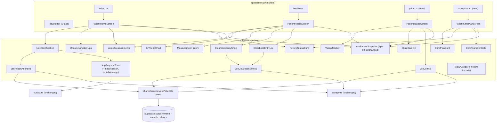

# Design: 03-patient-workspace

## Overview

This design implements `requirements.md` (P-1 to P-7) on branch `spec-03-patient`. K1–K9 are approved as proposed; K2 = glucose only.

**SQL: none.** No migration, no `supabase/apply_spec3.sql`, `setup.sql` untouched. Prerequisite: `supabase/apply_foundation.sql` has been applied (Spec 01).

**Shared files: none changed.** The only new file outside the patient folders is `src/shared/services/apiPatient.ts`, which the parallel-branch rules allow. `docs/spec-3-shared-edits.md` is created only if implementation is forced to touch a shared file.



---

## 1. Files

All paths are under `apps/mobile/`.

### New

| Path | Purpose | Req |
|---|---|---|
| `app/patient/yakap.tsx` | Shell → `PatientYakapScreen` | K6 |
| `app/patient/care-plan.tsx` | Shell → `PatientCarePlanScreen` | K6 |
| `src/shared/services/apiPatient.ts` | `reportAttended`, `insertPatientLabEntry`, `fetchRecordById`, `fetchClinics` | P-1.3, P-3.6, P-5 |
| `src/features/patient/copy.ts` | Patient-only EN/FIL strings (headings, K4 text, disclaimers, YAKAP copy) | P-7.7 |
| `src/features/patient/logic/nextStep.ts` | `nextAppointment`, `upcomingFollowUps`, `findAnotherDateRequest`, `reviewState` | P-1, P-6.2, K5, K7 |
| `src/features/patient/logic/measurements.ts` | `latestMeasurements`, `measurementHistory`, `isOlderReading`, `bpTrendPoints`, `measuredDate` | P-2 |
| `src/features/patient/logic/clearbook.ts` | `ClearbookEntry` type, `validateEntry`, `buildEntry`, `toInsertRow`, `entryToRecord`, `sameEntryContent`, `mergeRecords` | P-3 |
| `src/features/patient/logic/yakap.ts` | `YAKAP_STAGES` (stage, label, patient action), `stageIndex`, `isClinicConfirmed` | P-4 |
| `src/features/patient/hooks/useReportAttended.ts` | Online-only attendance update + snapshot patch | P-1.3–1.5 |
| `src/features/patient/hooks/useClearbookEntries.ts` | Local entry store, save, one share attempt, Share now | P-3 |
| `src/features/patient/hooks/useClinics.ts` | Clinic list, cache-then-network | P-5.6, K9 |
| `src/features/patient/components/NextStepSection.tsx` | `NextStepCard` + three actions + attendance confirm + another-date logic | P-1.2–1.8 |
| `src/features/patient/components/UpcomingFollowUps.tsx` | Other upcoming appointments | P-1.1 |
| `src/features/patient/components/LatestMeasurements.tsx` | Four `MeasurementCard`s + "Older reading" + "No readings yet" | P-1.1, P-2.1–2.3 |
| `src/features/patient/components/ReviewStatusCard.tsx` | Clinical chip for the review state | P-1.1, P-6.2 |
| `src/features/patient/components/BPTrendChart.tsx` | Dated BP range bars, View-only (no new dependency) | P-2.5–2.6 |
| `src/features/patient/components/MeasurementHistory.tsx` | Per-measure history lists | P-2.4 |
| `src/features/patient/components/ClearbookEntrySheet.tsx` | Form → confirm step → saved state | P-3.1–3.6, 3.8 |
| `src/features/patient/components/ClearbookEntryList.tsx` | "Entered by you" list with chips and Share now | P-3.6–3.7 |
| `src/features/patient/components/YakapTracker.tsx` | Eight-stage tracker | P-4 |
| `src/features/patient/components/ClinicCard.tsx` | One expandable clinic card | P-5.1–5.5 |
| `src/features/patient/components/CarePlanCard.tsx` | Full released plan | P-6.1 |
| `src/features/patient/components/CareTeamContacts.tsx` | BHW + clinic contacts | P-6.4 |
| `src/features/patient/screens/PatientYakapScreen.tsx` | YAKAP & Clinics tab | P-4, P-5 |
| `src/features/patient/screens/PatientCarePlanScreen.tsx` | Care Plan tab | P-6 |

### Modified (patient folders only)

| Path | Change | Req |
|---|---|---|
| `app/patient/_layout.tsx` | Tabs: Home, My Health, YAKAP & Clinics, Care Plan, Profile | K6 |
| `src/features/patient/screens/PatientHomeScreen.tsx` | New order (§4.1); local `nextAppointment` moves to `logic/nextStep.ts` | P-1.1 |
| `src/features/patient/screens/PatientHealthScreen.tsx` | Rebuilt around measurements, trend, history and clearbook (§4.2) | P-2, P-3 |
| `src/features/patient/components/HelpRequestSheet.tsx` | Optional `initialReason` and `initialMessage` props, applied when the sheet opens | P-1.6 |
| `src/features/patient/components/YakapStepLine.tsx` | Labels read from `logic/yakap.ts` (one source) | P-4 |

Unchanged: `usePatientSnapshot.ts` (format and key), `useHelpRequests.ts`, `MyRequestsCard.tsx`, `SnapshotStatus.tsx`, `PatientProfileScreen.tsx`, every file under `src/shared/` except the new `apiPatient.ts`.

---

## 2. Remote queries (`src/shared/services/apiPatient.ts`)

Same style as `api.ts`: `requireSupabase()`, a local `unwrap`, typed results. Screens never import it; only patient hooks do.

```ts
const ATTENDABLE: EncounterStatus[] = ['requested', 'confirmed', 'rescheduled'];

/** Sets patient-reported attendance. Never touches a clinic-confirmed, missed or already-reported row. */
export async function reportAttended(appointmentId: string, patientId: string): Promise<Appointment | null> {
  // UPDATE … WHERE id = :id AND patient_id = :pid AND encounter_status IN (ATTENDABLE) RETURNING *
  return unwrap(
    await requireSupabase().from('appointments')
      .update({ encounter_status: 'patient_reported_attended', updated_at: new Date().toISOString() })
      .eq('id', appointmentId).eq('patient_id', patientId).in('encounter_status', ATTENDABLE)
      .select('*').maybeSingle()
  );
}
```

`null` means no row matched (already reported, or changed by the clinic). The hook then re-reads the appointment state via snapshot reload and shows "This appointment was already updated."

```ts
export type PatientLabInsert = Pick<HealthRecord,
  'id' | 'patient_id' | 'bhw_id' | 'record_type' | 'title' | 'notes' | 'local_id' | 'source'
  | 'measured_at' | 'glucose_value' | 'glucose_unit' | 'glucose_test_type'
  | 'origin' | 'transcription_status' | 'review_status' | 'created_on_device_at'>;

/** Exactly-once: client UUID, ON CONFLICT (id) DO NOTHING. */
export async function insertPatientLabEntry(row: PatientLabInsert, signal?: AbortSignal): Promise<void>;
/** Read-back by id. */
export async function fetchRecordById(id: string, signal?: AbortSignal): Promise<HealthRecord | null>;
/** All clinics, by name. */
export async function fetchClinics(): Promise<Clinic[]>;
```

`toInsertRow(entry)` produces (K1):

| Column | Value |
|---|---|
| `id`, `local_id` | entry id (both; `local_id` is UNIQUE so the legacy sync key can never collide) |
| `patient_id`, `bhw_id` | patient id; the snapshot's `patient.bhw_id` or null |
| `record_type` | `'lab_result'` |
| `title` | `'Blood glucose (entered by patient)'` |
| `notes` | null |
| `source` | `'online'` (transport) |
| `origin` | `'patient'` |
| `transcription_status` | `'confirmed'` |
| `review_status` | `'awaiting_clinical_review'` |
| `measured_at` | test date at 12:00 local time, ISO |
| `glucose_value`, `glucose_unit`, `glucose_test_type` | from the form |
| `created_on_device_at` | set at save |

The DB constraints `records_glucose_complete_check` and `records_glucose_value_check` match the form validation, so a valid entry is never rejected for content.

---

## 3. Pure logic (`src/features/patient/logic/`)

No React or React Native imports (types only), so task A3 can run them with `npx tsx`. `now` is always a parameter with a `Date.now()` default.

### 3.1 `nextStep.ts`

```ts
export const NEXT_STEP_STATUSES: EncounterStatus[] = ['requested', 'confirmed', 'rescheduled', 'patient_reported_attended'];
export function nextAppointment(appts: Appointment[], now?: number): Appointment | null;
  // scheduled_at >= start of today (so today's visit stays the next step after its hour), status in NEXT_STEP_STATUSES, earliest first
export function upcomingFollowUps(appts: Appointment[], exclude: string | null, now?: number): Appointment[];
  // same filter minus 'patient_reported_attended', excluding the next step's id
export function canReportAttended(a: Appointment): boolean; // status in requested | confirmed | rescheduled
export function findAnotherDateRequest(items: OutboxItem[], appt: Appointment): OutboxItem | null;
  // newest item with reason 'another_date', status !== 'conflict', created_on_device_at >= appt.updated_at (K5)
export type ReviewState = 'pending' | 'released' | 'none';
export function reviewState(records: HealthRecord[], plan: CarePlan | null, stage: YakapStage | null | undefined): ReviewState;
```

`reviewState` (K7):
- `pending` if any record has `review_status === 'awaiting_clinical_review'` and (`plan` is null or `created_at` > `plan.released_at`), or if `plan` is null and `stage === 'results_review_pending'`;
- else `released` if `plan` exists;
- else `none`.

Records here are server records only (the snapshot), so a local-only clearbook entry does not count as pending; nobody can review it yet.

Using `start of today` instead of `now` for the next step is deliberate: once the appointment hour has passed on the day, the patient can still tap **I already attended**.

### 3.2 `measurements.ts`

```ts
export type MeasureKey = 'bp' | 'glucose' | 'weight' | 'height';
export interface Reading { recordId: string; key: MeasureKey; value: string; unit: string; context?: string;
                           date: string | null; dateKind: 'measured' | 'recorded'; sortTime: number }
export function measuredDate(r: HealthRecord): { date: string | null; kind: 'measured' | 'recorded' };
  // measured_at, else created_at with kind 'recorded'
export function readingsFor(records: HealthRecord[], key: MeasureKey): Reading[]; // newest first, missing values skipped
export function latestMeasurements(records: HealthRecord[]): Record<MeasureKey, Reading | null>;
export function isOlderReading(date: string | null, now?: number): boolean; // > 90 × 86 400 000 ms before now
export interface TrendPoint { recordId: string; t: number; systolic: number; diastolic: number; date: string }
export function bpTrendPoints(records: HealthRecord[]): TrendPoint[];
```

Rules:
- BP needs both `systolic` and `diastolic` as finite numbers; value `"132/84"`, unit `mmHg`.
- Glucose needs value, unit and test type; context = "Fasting" / "Random" / "After a meal".
- Weight `kg`, height `cm`. `0` is never produced: a null or non-finite value is skipped, and `MeasurementCard` shows "No reading" for a null card.
- `bpTrendPoints` uses only records with a real `measured_at` (not the `created_at` fallback), sorted ascending, de-duplicated by record id. No interpolation, no zero.

### 3.3 `clearbook.ts`

```ts
export type ShareStatus = 'local' | 'sending' | 'synced' | 'failed';
export interface ClearbookEntry {
  v: 1; id: string; patient_id: string; bhw_id: string | null;
  glucose_value: number; glucose_unit: GlucoseUnit; glucose_test_type: GlucoseTestType;
  test_date: string;               // YYYY-MM-DD as entered
  measured_at: string;             // ISO, test date 12:00 local
  created_on_device_at: string;
  _share_status: ShareStatus; _last_error: string | null; _shared_at: string | null;
}
export const ENTRY_PREFIX = 'tuloy:v1:patient_entries:';
export interface EntryDraft { testType: GlucoseTestType | null; value: string; unit: GlucoseUnit | null; testDate: string }
export function validateEntry(d: EntryDraft, now?: number): { ok: true; value: number } | { ok: false; errors: Partial<Record<keyof EntryDraft, string>> };
export function buildEntry(d: EntryDraft, ids: { id: string; patientId: string; bhwId: string | null }, now?: number): ClearbookEntry;
export function isClearbookEntry(v: unknown): v is ClearbookEntry;
export function toInsertRow(e: ClearbookEntry): PatientLabInsert;
export function entryToRecord(e: ClearbookEntry): HealthRecord;  // for measurement logic and lists
export function sameEntryContent(e: ClearbookEntry, r: HealthRecord): boolean;
export function mergeRecords(server: HealthRecord[], entries: ClearbookEntry[]): HealthRecord[];
```

- **Validation** (P-3.2): test type and unit required; value parsed with `parseOptionalNumber`, must be finite, `> 0` and `≤ 99999.9`, at most one decimal place (NUMERIC(6,1)); test date via `parseYMD`, not after today. Error texts are plain ("Enter the value from your paper").
- **sameEntryContent**: `patient_id`, `glucose_value` (numeric equality), unit, test type, and `Date.parse(measured_at)` equal. A mismatch is reported as failed with "A different record with this ID exists. Nothing was overwritten." (no retry offered for that case).
- **mergeRecords**: server records win by id (they carry the server's `review_status`); entries not on the server are appended via `entryToRecord` (`source 'online'`, `origin 'patient'`, `created_at = created_on_device_at`).

### 3.4 `yakap.ts`

```ts
export interface YakapStageInfo { stage: YakapStage; label: string; fil: string; patientAction: string }
export const YAKAP_STAGES: YakapStageInfo[];   // brief §3 order, 8 entries
export function stageIndex(stage: YakapStage | null | undefined): number; // -1 if null/unknown
export function isClinicConfirmed(appts: Appointment[], clinicId: string | null | undefined): boolean;
  // some appointment with clinic_id === clinicId and encounter_status 'clinic_confirmed_attended'
```

| Stage | Label | Patient action |
|---|---|---|
| `need_help_getting_started` | Need help getting started | View official enrollment guidance, find a clinic, or ask your health worker for help |
| `clinic_selected_pending` | Clinic selected · confirmation pending | Save your chosen clinic and its contact details |
| `first_checkup_planned` | First checkup planned | See the date, place and any preparation the clinic gives you |
| `checkup_and_assessment` | Checkup and risk assessment | Attend your consultation and have your measurements recorded |
| `tests_requested` | Tests requested, if needed | See the tests your clinician asked for and where to get them |
| `results_review_pending` | Results available · review pending | Add your paper report, or ask for help entering it |
| `plan_available` | Plan available | Read the plan your clinician released |
| `continued_monitoring` | Continued monitoring | See your next follow-up and record requested measurements |

The clinic-selection row's label is computed: "Clinic confirmed" only when `isClinicConfirmed`, else "Clinic selected · confirmation pending" (P-4.3).

---

## 4. Screens

All screens use `Screen`, read `usePatientSnapshot(useCurrentPatientId())`, and render `SnapshotStatus` (loading → spinner; `none` → "Connect once to load your information"; stale → `LastUpdated` + reason). `OfflineBanner` is already rendered by `RoleTabsLayout`.

### 4.1 Home (`PatientHomeScreen`)

Order (P-1.1):
1. `SnapshotStatus` (status, not content).
2. `NextStepSection` (or the existing "No next step scheduled yet" card with **I need help**).
3. `UpcomingFollowUps` — hidden when empty. Falls back to the legacy record appointments only when `appointments` is empty (existing behaviour, no duplicates).
4. `LatestMeasurements` (records = `mergeRecords(snapshot.records, entries)`), with a link-style button **See My Health**.
5. `ReviewStatusCard` (`reviewState(...)`).
6. Existing: `YakapStepLine`, "Need help?" card, `MyRequestsCard`, `CarePlanSummaryCard`, `CareTeamCard`, "Your clinic", `ConnectionTest`.

The "Latest health updates" card is removed from Home (its content is on My Health), so Home stays action-first.

### 4.2 `NextStepSection`

```tsx
<NextStepCard action={appt.purpose} responsible={clinicName} date={appt.scheduled_at}
              status={`encounter.${appt.encounter_status}`} onHelp={openHelp}>
  {appt.encounter_status === 'patient_reported_attended'
     ? <Text>Waiting for the clinic to confirm</Text>
     : <Button title="I already attended" disabled={isOnline === false || busy} onPress={openConfirm} />}
  {isOnline === false && canReportAttended(appt) ? <Text>{ATTEND_OFFLINE}</Text> : null}
  {existing ? <AnotherDateStatus item={existing} /> : <Button title="I need another date" variant="secondary" onPress={openAnotherDate} />}
  {attendError ? <Notice tone="error" message={attendError} /> : null}
</NextStepCard>
<ConfirmSheet title="Did you attend this appointment?" message="…<purpose>, <date>. Your clinic will still confirm it." confirmLabel="Yes, I attended" … />
```

- `existing = findAnotherDateRequest(requests.items, appt)`; `AnotherDateStatus` = "You asked for another date on <created, DMY time>" + `StatusChipRow(outboxStatusKeys(item._sync_status, 'help_request'))`.
- `openAnotherDate` opens the Home `HelpRequestSheet` with `initialReason='another_date'`, `initialMessage='About: <purpose>, <DD Mon YYYY>'`. `openHelp` opens it with no presets. Home holds one sheet and a `preset` state.
- The help button is the `NextStepCard` built-in **I need help**. All buttons are ≥ 44 px (shared `Button`).

`HelpRequestSheet` change: on `visible` false→true, if presets are given and the form is empty, set `reason` and `message` from them. The id-per-session, validation, saving and saved-state logic are untouched.

### 4.3 `useReportAttended`

```ts
export function useReportAttended(patientId: string, reload: () => Promise<void>): {
  busyId: string | null; error: string | null; report(appt: Appointment): Promise<boolean>;
};
```

1. If `isOnline === false` → return false (button is disabled anyway).
2. `row = await reportAttended(appt.id, patientId)`.
3. `row === null` → error "This appointment was already updated. Pull to refresh." and `reload()`.
4. Else patch the stored snapshot (`getItem(snapshotKey)` → replace the appointment by id → `setItem`), guarded by `currentEpoch()`, then `reload()`. A patch failure is logged; the fresh reload still shows the new status.
5. Errors → `toUserMessage(e, 'Could not update your attendance.')`; status unchanged.

### 4.4 My Health (`PatientHealthScreen`)

1. `SnapshotStatus`.
2. "Latest measurements" — `LatestMeasurements` (same component as Home). Each card with an older date gets the text "Older reading" (with the `clock` icon) under it. All four null → `EmptyState` "No readings yet".
3. "Blood pressure trend" — `BPTrendChart`.
4. "History" — `MeasurementHistory`: one card per measure with rows "value unit · Measured DD Mon YYYY" (+ "Older reading"), newest first; "No reading" when empty.
5. "Lab results you entered" — **Add a lab result from my paper** button + `ClearbookEntryList`.
6. Existing "Health updates" `HealthRecordCard` (non-measurement BHW notes).

Removed: the `StatTile`s ("Home visits" count etc.); they are not dated readings.

The Clearbook section renders even without a snapshot (entries are local), so a patient can add a reading offline before ever loading Home.

### 4.5 `BPTrendChart`

View-only, no SVG dependency. Fixed height 180, width from `onLayout`.

- `points = bpTrendPoints(records)`. `< 2` → text "Not enough dated readings for a trend yet" (P-2.6).
- x = `pad + (t - tMin) / max(1, tMax - tMin) * (width - 2·pad)`; y range = `[min(diastolic) - 10, max(systolic) + 10]`.
- Each reading is a vertical range bar from diastolic to systolic at its x, with a filled circle at systolic and a hollow square at diastolic (shape, not colour, separates them), a value label "132/84" above and "DD Mon" below.
- No line segments are drawn between readings, so nothing is interpolated (P-2.5).
- Legend: "● Top number (systolic) · □ Bottom number (diastolic) · mmHg".
- The chart container has `accessible` and `accessibilityLabel` = "Blood pressure readings: 132/84 on 22 Sep 2026; 138/88 on …". Under it, the note "Shows dated readings only. Tuloy does not interpret results."

### 4.6 Clearbook (`ClearbookEntrySheet`, `useClearbookEntries`, `ClearbookEntryList`)

```ts
export function useClearbookEntries(patientId: string, bhwId: string | null): {
  entries: ClearbookEntry[]; loading: boolean; error: string | null;
  save(draft: EntryDraft): Promise<ClearbookEntry>;   // throws "Could not save on this device: …"
  share(id: string): Promise<void>;                   // one attempt; no-op offline
};
```

- **Storage:** one key per entry, `tuloy:v1:patient_entries:<id>`, listed with `listItems(ENTRY_PREFIX)`, filtered by `patient_id`, invalid values skipped and logged (never deleted). Newest `created_on_device_at` first. `clearDemoData` already clears the prefix (Reset).
- **save:** `buildEntry` with `newId()` created once per sheet session (double tap = one entry) → `setItem` → `getItem` read-back; missing → throw. Then, if `isOnline !== false`, call `share(id)` without awaiting.
- **share(id)** — single-flight per id (module-level `Set`), epoch-guarded writes:
  1. `put({_share_status: 'sending'})`.
  2. `insertPatientLabEntry(toInsertRow(e), signal)` with a 10 s `AbortController` timeout, then `fetchRecordById(id)`.
  3. Row with `sameEntryContent` → `synced`, `_shared_at = now`. No row → `failed` ("Not confirmed yet."). Different content → `failed` with the conflict text. Error → `failed`, `_last_error = toUserMessage(e)`.
  4. Then `reloadSnapshot()` so the server record (with its `review_status`) appears.
- **Load:** on mount, any `sending` entry is reset to `failed` with "Sending was interrupted." so Share now is offered.
- There is no automatic retry, backoff or reconnect trigger (K3).

`ClearbookEntrySheet` steps, using the same modal pattern as `HelpRequestSheet` (backdrop, Escape, Android back, focus on open):
1. **Form** — `ChipGroup` test type (Fasting / Random / After a meal), `TextField` value (`keyboardType="decimal-pad"`), `ChipGroup` unit (mg/dL / mmol/L), `TextField` test date (YYYY-MM-DD placeholder), inline errors, the note "Tuloy does not interpret results. A clinician will review it.", **Cancel** / **Save** (disabled until `validateEntry` ok).
2. **Confirm** (P-3.3) — "Check this against your paper" + the summary line, **Go back** / **Save**.
3. **Saved** — heading "Saved on this device", then the live chips from the entry list, **Done**. Save errors return to the form with `Notice tone="error"`.

`ClearbookEntryList` row: "Blood glucose · Fasting", "126 mg/dL", "Test date 27 Sep 2026", "Entered by you · confirmed by you", and chips:

| `_share_status` | Chips | Extra |
|---|---|---|
| `local` | `transport.saved_on_device` | "Not shared with your care team yet" + **Share now** (online) |
| `sending` | `transport.sending` | — |
| `failed` | `transport.saved_on_device`, `transport.send_failed` | `_last_error` + **Share now** (online; offline: "Connect to share it.") |
| `synced` | `transport.synced`, then `clinical.awaiting_clinical_review` (or the server record's `clinicalStatusKey`) | — |

Footer: `DEFERRED_BACKUP` ("Saved on this device only. Backup and restore aren't available yet."). Empty: "No lab results entered yet."

### 4.7 YAKAP & Clinics (`PatientYakapScreen`)

1. Title "My YAKAP Checkup", subtitle (FIL) and the copy "Get help accessing YAKAP benefits and completing your next care step".
2. `SnapshotStatus`.
3. `YakapTracker` — eight rows. Current row: 2 px primary border, `primaryBg`, "You are here" label with the `flag` icon, and its patient action. Earlier rows: `check` icon + "Done". Later rows: `circle` icon + "Later". `stageIndex = -1` → "Not started yet" and no highlight. Rows have `accessibilityLabel` "Step n of 8: <label>, <state>".
4. Note: "Choosing a clinic in Tuloy is not YAKAP enrollment. Your clinic confirms it." + **Ask for help getting started** (opens `HelpRequestSheet`, no preset) + **Official PhilHealth YAKAP page** button.
5. "Clinics" — `useClinics` list of `ClinicCard`, sorted with the patient's clinic first.

`ClinicCard` (collapsed shows name, address, "Your clinic…" tag; tapping the header toggles, `accessibilityState.expanded`):

| Field | Shown as |
|---|---|
| Services | comma list, or "Unknown" |
| Address / Contact | value or "Unknown" |
| YAKAP accreditation | `listed` → "Listed (source: <source or Unknown>)"; `unknown` → "Unknown" |
| Availability | "Unknown" (K8) |
| Source | value or "Unknown" |
| Last verified | "DD Mon YYYY" or "Not verified" |

Expanded also shows "Opening this card does not book an appointment. Ask your health worker or call the clinic." and the **Official PhilHealth YAKAP page** button. `Linking.openURL('https://www.philhealth.gov.ph/yakap/')` from `react-native`; offline the button is disabled with "Needs a connection".

`useClinics()`: read `tuloy:v1:clinics` (`{ v: 1, last_updated_at, clinics }`, shape-checked) → show; if `isOnline !== false`, `fetchClinics()` → write (epoch-guarded; a write failure is a non-fatal notice) → show. Reload on focus and on reconnect. States: loading spinner; `none` offline → "Connect once to load the clinic list"; error with cache → "Showing saved information. <reason>"; error without cache → `Notice` error + **Try again**; empty → "No clinics listed yet".

### 4.8 Care Plan (`PatientCarePlanScreen`)

1. `SnapshotStatus`.
2. `state = reviewState(records, care_plan, stage)`.
3. `pending` → `ReviewStatusCard` (chip "Awaiting clinical review", text "A clinician will review your results. Your plan shows here when it is released."). If a plan exists, it follows under the heading "Your last released plan".
4. `released` → `CarePlanCard`: chip "Plan released", summary, "Next steps" (if any), "Released by <clinician or 'your clinician'> · <DD Mon YYYY>". DEMO badge.
5. `none` → `EmptyState` "No care plan yet" / "Your clinician releases it after your checkup."
6. `CareTeamContacts`: "Your health worker" — name, barangay, phone or "Unknown", or "No health worker assigned yet"; "Your clinic" — name and contact or "Unknown". DEMO badge. No call/edit/release actions.

Only `snapshot.care_plan` is read; `fetchReleasedCarePlan` already filters `status = 'released'`, so drafts never reach the device.

---

## 5. Copy (`src/features/patient/copy.ts`)

```ts
export const PATIENT_COPY = {
  tabs: { yakap: 'YAKAP & Clinics', carePlan: 'Care Plan' },
  yakapTagline: 'Get help accessing YAKAP benefits and completing your next care step',
  notEnrollment: 'Choosing a clinic in Tuloy is not YAKAP enrollment. Your clinic confirms it.',
  noBooking: 'Opening this card does not book an appointment. Ask your health worker or call the clinic.',
  noInterpretation: 'Tuloy does not interpret results. A clinician will review it.',
  attendOffline: 'Connect to report that you attended. You can still ask for help.',
  attendWaiting: 'Waiting for the clinic to confirm',
  olderReading: 'Older reading',
  noReadings: 'No readings yet',
  ...
} as const;
export const PATIENT_COPY_FIL = { … }; // FIL: needs native-speaker review
```

Section headings render as "English · Filipino" subtitles via `Card subtitle`.

Banned in Patient copy (checked by A2): "healthy", "health score", "risk score", "normal", "high blood", "free", "libre", "walang bayad", "guarantee", "booked", "reserved", "enrolled", "monitor", "24/7", "real-time".

---

## 6. Offline, reset and error behaviour

| Data | Offline source | Reset |
|---|---|---|
| Home, Health, YAKAP tracker, Care Plan, Profile | snapshot (Spec 02) | cleared by `clearDemoData` |
| Clearbook entries | `tuloy:v1:patient_entries:*` | cleared by `clearDemoData` |
| Clinic list | `tuloy:v1:clinics` | cleared by `clearDemoData` |
| Help requests | outbox (Spec 02) | unchanged |

- Async writes started before a Reset are discarded with the existing `currentEpoch()` check.
- Every storage write is awaited before the UI confirms; failures surface as `Notice tone="error"` (tech.md §5).
- `isOnline === null` (unknown at start) is treated as "try": network actions run, and errors are shown.

---

## 7. Testing strategy

| ID | Check |
|---|---|
| A1 | `npm run typecheck` in `apps/mobile` passes after every task. No `any` in new files (grep `: any\b\|as any`). |
| A2 | Copy grep over `src/features/patient` and `app/patient` for the §5 banned list; every hit reviewed (identifiers and negations like "does not book" are allowed). |
| A3 | Temporary `npx tsx` script in `$env:TEMP` importing `logic/*.ts`: `nextAppointment` (past/future, statuses, start-of-day), `findAnotherDateRequest` (before/after `updated_at`, conflict ignored), `reviewState` (all three K7 cases), `readingsFor` (null ≠ 0, missing unit skipped), `isOlderReading` (89/90/91 days), `bpTrendPoints` (undated and partial readings excluded, sorted, no zeros), `validateEntry` (each field, future date, 0, 100000, two decimals), `sameEntryContent`, `mergeRecords` (dedupe by id), `stageIndex`, `isClinicConfirmed`. Deleted afterwards. |
| A4 | `npx expo export --platform web` succeeds; `dist/patient/yakap.html` and `dist/patient/care-plan.html` exist. `dist/` is not committed. |

Manual steps M1–M11 are listed in `tasks.md`, run on `npx serve dist` (offline cases) and `expo start --web` (online cases), as Juana via `/demo`.
